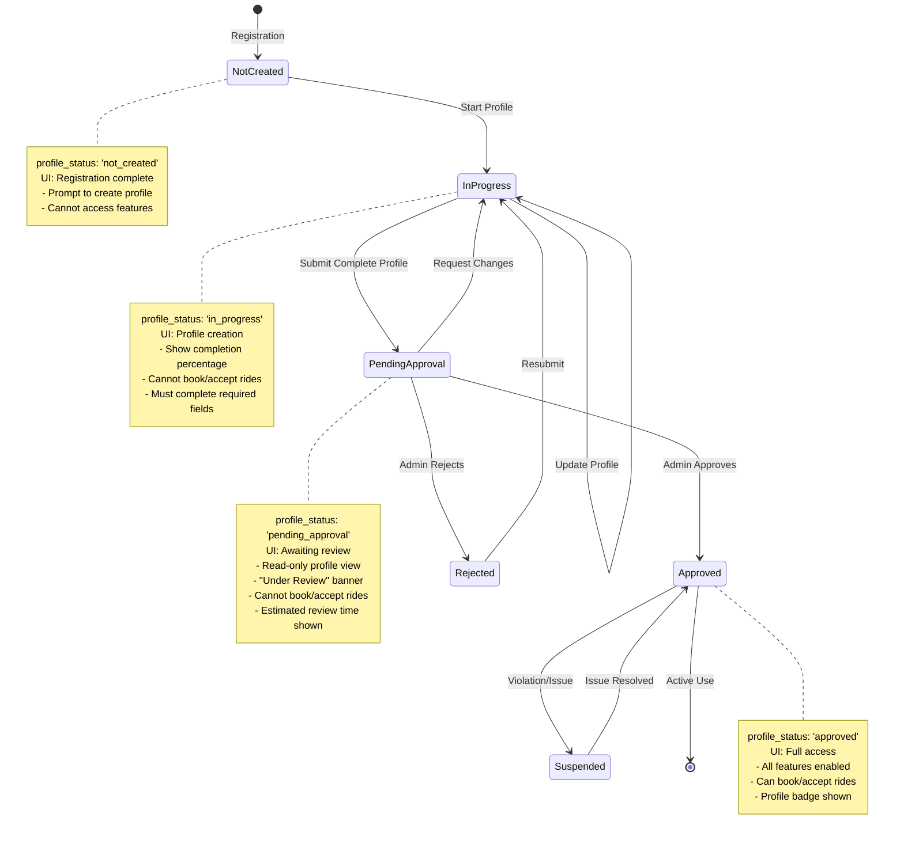
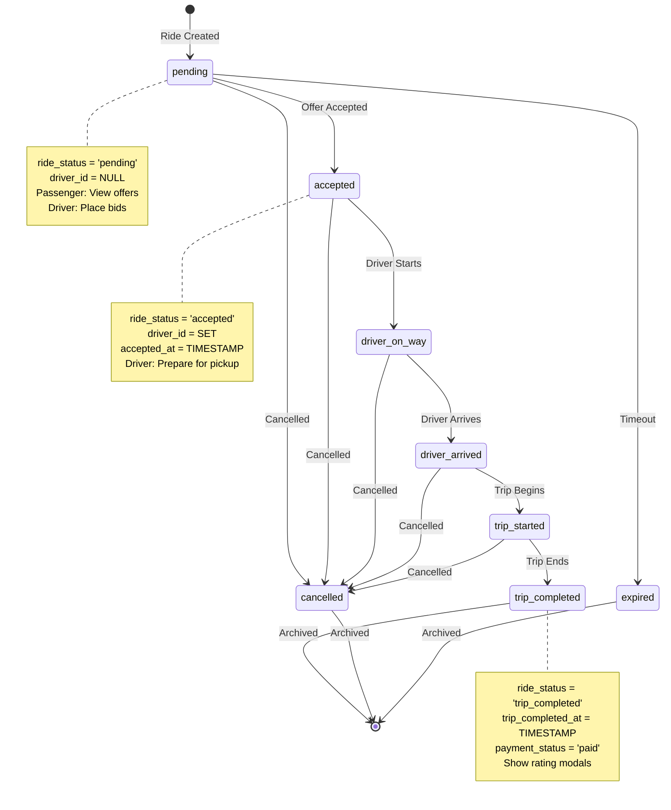

# Design Document

## Overview

This design document outlines the comprehensive documentation strategy for the Movers Finder platform (formerly TaxiCab), including analysis of the current implementation and specifications for new features. The documentation will serve as the single source of truth for all platform processes, user flows, and technical implementation details across three applications: pwa_app (e-hailing PWA), taxicab_landing (marketing site), and bmtoa_landing (members platform).

The project encompasses:
1. **Current Implementation Analysis**: Deep dive into existing authentication, profile management, ride booking, and all operational features
2. **Documentation Creation**: Comprehensive process documentation with diagrams, state machines, and code examples
3. **New Feature Specifications**: Detailed specifications for AI booking, expanded ride categories, and driver/operator enhancements
4. **Rebranding Guidelines**: Transition from TaxiCab to Movers Finder branding

## Architecture

### Documentation Structure

```
/docs
├── README.md                           # Main index and navigation
├── executive-summary.md                # High-level platform overview
├── architecture/
│   ├── system-architecture.md          # Overall system design
│   ├── database-schema.md              # Complete database documentation
│   ├── api-endpoints.md                # RPC functions and API documentation
│   └── technology-stack.md             # Technologies and frameworks used
├── authentication/
│   ├── overview.md                     # Authentication system overview
│   ├── individual-auth.md              # Individual user authentication
│   ├── corporate-auth.md               # Corporate user authentication
│   ├── driver-auth.md                  # Driver authentication
│   ├── operator-auth.md                # Operator authentication
│   └── admin-auth.md                   # Admin authentication
├── profiles/
│   ├── profile-states.md               # Profile state machine documentation
│   ├── individual-profiles.md          # Individual profile management
│   ├── corporate-profiles.md           # Corporate profile management
│   ├── driver-profiles.md              # Driver profile management
│   ├── operator-profiles.md            # Operator profile management
│   └── approval-workflows.md           # Approval process documentation
├── ride-management/
│   ├── booking-process.md              # Ride booking flows
│   ├── ride-categories.md              # All ride categories and features
│   ├── pricing-calculation.md          # Pricing methodology
│   ├── bidding-system.md               # Driver bidding process
│   ├── ride-lifecycle.md               # Complete ride state machine
│   ├── scheduled-rides.md              # Scheduled and recurring rides
│   └── bulk-rides.md                   # Corporate bulk ride features
├── features/
│   ├── ai-booking.md                   # AI-powered audio booking (NEW)
│   ├── profile-sharing.md              # Driver/operator profile sharing (NEW)
│   ├── saved-items.md                  # Saved drivers, rides, addresses
│   ├── payment-methods.md              # Payment options and accounts
│   ├── driver-performance.md           # Performance metrics (NEW)
│   └── community-chat.md               # Driver/operator community (NEW)
├── user-journeys/
│   ├── individual-journey.md           # Complete individual user flow
│   ├── corporate-journey.md            # Complete corporate user flow
│   ├── driver-journey.md               # Complete driver user flow
│   └── operator-journey.md             # Complete operator user flow
├── processes/
│   ├── ride-completion.md              # Ride completion process
│   ├── cancellation.md                 # Cancellation workflows
│   ├── rating-review.md                # Rating and review system
│   └── referral-program.md             # Referral mechanics
└── ui-specifications/
    ├── passenger-interface.md          # Passenger UI specifications
    ├── driver-interface.md             # Driver UI specifications
    ├── operator-interface.md           # Operator UI specifications
    └── admin-interface.md              # Admin UI specifications
```

### Analysis Methodology

The documentation creation follows a systematic approach:

1. **Code Analysis Phase**
   - Use file reading tools to examine source code
   - Use grep search to find patterns and implementations
   - Use Supabase MCP to query database schema
   - Review existing documentation (TAXICAB_RIDE_MANAGEMENT_ANALYSIS.md)

2. **Documentation Phase**
   - Create process flow diagrams using Mermaid
   - Document state machines for all stateful processes
   - Include actual code examples with file paths
   - Separate current vs. planned features

3. **Validation Phase**
   - Cross-reference code with documentation
   - Verify database schema matches implementation
   - Ensure all user types are covered
   - Validate completeness of process flows

## Components and Interfaces

### Documentation Components

#### 1. Executive Summary
**Purpose**: High-level overview for stakeholders
**Content**:
- Platform purpose and value proposition
- Key features and capabilities
- User types and their roles
- Technology stack overview
- Current status and roadmap

#### 2. Architecture Documentation
**Purpose**: Technical system design
**Content**:
- System architecture diagrams
- Database schema with all tables, fields, relationships
- RPC functions and their purposes
- Real-time subscription patterns
- Authentication and authorization flows

#### 3. Authentication Documentation
**Purpose**: Complete auth system documentation
**Content** (per user type):
- Registration flow with diagrams
- Login flow (password and OTP)
- Password recovery process
- Session management
- Platform access validation
- Code examples from actual implementation

#### 4. Profile Management Documentation
**Purpose**: Profile lifecycle and state management
**Content**:
- Profile state machine (Incomplete → Awaiting Approval → Approved)
- State-based UI rendering
- Profile creation workflows per user type
- Profile update processes
- Approval workflows for Driver and Operator
- Profile completion requirements

#### 5. Ride Management Documentation
**Purpose**: Complete ride booking and lifecycle
**Content**:
- Booking process for all user types
- Ride categories (existing and new)
- Pricing calculation methodology
- Bidding system (inDrive-style)
- Ride state machine (Pending → Active → Completed)
- Scheduled and recurring rides
- Bulk rides for corporates

#### 6. Feature Documentation
**Purpose**: Individual feature specifications
**Content**:
- AI-powered audio booking (NEW)
- Profile sharing for drivers/operators (NEW)
- Saved drivers, rides, and addresses
- Payment methods (prepaid, credit accounts)
- Driver performance metrics (NEW)
- Community chat (NEW)

#### 7. User Journey Documentation
**Purpose**: End-to-end user experiences
**Content** (per user type):
- Complete user flow from registration to ride completion
- UI screenshots and wireframes
- Decision points and user actions
- System responses and notifications
- Error handling and edge cases

#### 8. Process Documentation
**Purpose**: Specific process workflows
**Content**:
- Ride completion with rating
- Cancellation workflows
- Rating and review system
- Referral program mechanics
- Payment processing

#### 9. UI Specifications
**Purpose**: Interface design and behavior
**Content** (per user type):
- Screen layouts and navigation
- Component specifications
- Interaction patterns
- State-based UI changes
- Responsive design considerations

## Data Models

### Profile States

**Current Implementation (from database schema):**

Profile states are tracked via `profile_status` field with these values:
- `not_created`: Profile record exists but user hasn't started filling details
- `in_progress`: User is actively filling out profile information
- `pending_approval`: Profile submitted and awaiting admin review
- `approved`: Profile approved by admin, user has full access
- `rejected`: Profile rejected by admin, user must resubmit

Additional status fields:
- `approval_status`: `pending`, `approved`, `rejected`
- `profile_completion_status`: `incomplete`, `complete`
- `account_status`: `active`, `disabled`, `suspended`
- `completion_percentage`: 0-100 integer



### User Type Profile Requirements

**Current Implementation:**

| User Type | Approval Required | Profile States | Special Requirements |
|-----------|------------------|----------------|---------------------|
| **Individual** | No | not_created → in_progress → approved (auto) | Basic info only, auto-approved |
| **Corporate** | Only for credit accounts | not_created → in_progress → approved (auto for regular payment) | Company details, credit requires approval via `corporate_credit_status` |
| **Driver** | Yes | not_created → in_progress → pending_approval → approved | Vehicle, license, insurance docs, BMTOA membership optional |
| **Operator** | Yes | not_created → in_progress → pending_approval → approved | Fleet details, business registration, BMTOA verification |
| **Admin** | N/A (manually created) | approved | Full platform access |

**Profile-Specific Fields:**

**Individual Profiles:**
- `service_preferences`: JSONB array (default: `["taxi"]`)
- `saved_places`: JSONB array
- `payment_methods`: JSONB array
- `preferences`: JSONB object
- `total_rides`, `total_spent`: Usage tracking

**Corporate Profiles:**
- `company_name`, `company_size`, `business_registration`
- `credit_balance`, `credit_limit`, `low_balance_threshold`
- `corporate_credit_status`: `not_requested`, `pending`, `approved`, `rejected`
- `billing_method`: JSONB array
- `auto_invoice`: boolean

**Driver Profiles:**
- Vehicle details: `vehicle_make`, `vehicle_model`, `vehicle_year`, `vehicle_color`, `license_plate`
- Documents: `license_document`, `vehicle_registration`, `insurance_certificate`, `roadworthy_certificate`
- Banking: `bank_name`, `account_number`, `account_holder_name`, `ecocash_number`
- BMTOA: `bmtoa_member`, `bmtoa_membership_number`
- Operator assignment: `operator_id`, `operator_approval_status`

**Operator Profiles:**
- Company: `company_name`, `business_registration`, `fleet_size`
- BMTOA: `bmtoa_member_number`, `bmtoa_verified`, `membership_tier`
- Grace period: `grace_period_active`, `grace_period_days_remaining`
- Fleet tracking: `total_drivers`, `monthly_revenue`

### Ride Categories

#### Existing Categories (Current Implementation)

**From Database Schema - `service_type` field:**

| Category | Description | Unique Features | Database Fields |
|----------|-------------|-----------------|-----------------|
| **Taxi** | Standard passenger transport | Round-trip (`is_round_trip`), multiple passengers (`number_of_passengers`) | `service_type='taxi'`, `ride_type='taxi'` |
| **Courier** | Package delivery | Package size (`package_size`: small/medium/large/extra_large), recipient details | `courier_package_details`, `recipient_name`, `recipient_phone` |
| **Errands** | Multiple stop tasks | Chain of pickup/dropoff locations, task list | `errand_tasks` (JSONB), `number_of_tasks`, `additional_stops` |
| **School Run** | Student transportation | Recurring schedules, guardian info | `ride_type='school_run'`, `passenger_name`, `contact_number` |
| **Work Run** | Commuter transport | Recurring schedules, corporate accounts | `ride_type='work_run'`, linked to `scheduled_trips` |
| **Corporate** | Business bookings | Bulk rides, passenger management | `service_type='corporate'`, `company_id`, `booking_source='corporate'` |
| **Recurring** | Repeating rides | Series management, reminders | `service_type='recurring'`, `series_id`, `recurrence_pattern` |

**Ride Timing Types (`ride_timing` field):**
- `instant`: Immediate ride request
- `scheduled_single`: One-time future ride
- `scheduled_recurring`: Repeating ride series

### Ride States and Lifecycle

**Current Implementation (from database and code analysis):**

#### Ride Status Field (`ride_status`)

Primary status field with these values:
- `pending`: Ride created, awaiting driver offers
- `accepted`: Driver offer accepted by passenger
- `driver_on_way`: Driver heading to pickup location
- `driver_arrived`: Driver at pickup location
- `trip_started`: Journey in progress
- `trip_completed`: Trip finished successfully
- `cancelled`: Ride cancelled by passenger or driver

#### Passenger-Side States

| State | Description | User Actions | System Behavior |
|-------|-------------|--------------|-----------------|
| **PENDING** | Awaiting driver offers | View offers, accept/reject, cancel | Broadcast to drivers, collect offers |
| **ACTIVE** | Ride in progress | View status, contact driver, cancel | Real-time status updates |
| **COMPLETED** | Trip finished | Rate driver, save trip/driver | Show rating modal, process payment |
| **CANCELLED** | Ride cancelled | View reason, rebook | Record cancellation details |
| **SAVED** | Trip templates | Use template, edit, delete | Pre-fill booking form |

**Active Sub-States (passenger view):**
- `accepted`: Driver confirmed
- `driver_on_way`: Driver heading to pickup
- `driver_arrived`: Driver at pickup
- `trip_started`: Journey in progress

#### Driver-Side States

| State | Description | User Actions | System Behavior |
|-------|-------------|--------------|-----------------|
| **AVAILABLE** | Rides to bid on | View rides, place bid | Show pending rides, filter options |
| **MY BIDS** | Pending offers | View offers, wait | Track offer status |
| **ACTIVE** | Accepted rides | Progress status, complete | Status progression, notifications |
| **COMPLETED** | Finished trips | Rate passenger, view earnings | Show rating modal |

**Active Sub-States (driver view):**
- `accepted`: Ride confirmed, preparing
- `driver_on_way`: Heading to pickup
- `driver_arrived`: At pickup location
- `trip_started`: Journey in progress

#### State Transition Diagram



#### New Categories (To Be Implemented)

| Category | Description | Unique Features | Pricing Base |
|----------|-------------|-----------------|--------------|
| **Bulk** | Multiple items/packages | Volume pricing, multiple pickups | Volume + distance |
| **Car Hire** | Vehicle rental | Hourly/daily rates, driver optional | Time-based |
| **Refuse Movers** | Waste removal | Load size, disposal fees | Load size + distance |
| **Gas Movers** | Gas cylinder delivery | Cylinder size, safety requirements | Fixed + distance |
| **House Movers** | Household relocation | Inventory list, packing services | Volume + distance + labor |
| **Haulage** | Heavy goods transport | Weight limits, special equipment | Weight + distance |
| **Other** | Custom services | Flexible requirements | Custom quote |

### Payment Methods

**Current Implementation (from database schema):**

| Method | Database Value | Available To | Approval Required | Features |
|--------|----------------|--------------|-------------------|----------|
| **EcoCash** | `ecocash` | All users | No | Mobile money (Zimbabwe) |
| **OneMoney** | `onemoney` | All users | No | Mobile money (Zimbabwe) |
| **Bank Transfer** | `bank_transfer` | All users | No | Direct bank payment |
| **Cash** | `cash` | All users | No | Pay on completion |
| **USD Card** | `usd_card` | All users | No | Card payment in USD |
| **Corporate Account** | `corporate_account` | Corporate only | No (but credit requires approval) | Company billing |

**Payment Status (`payment_status` field):**
- `pending`: Payment not yet processed
- `paid`: Payment completed
- `failed`: Payment attempt failed
- `refunded`: Payment refunded

**Corporate Credit System:**
- `credit_balance`: Current credit balance
- `credit_limit`: Maximum credit allowed
- `corporate_credit_status`: `not_requested`, `pending`, `approved`, `rejected`
- `low_balance_threshold`: Alert threshold
- `auto_invoice`: Automatic invoice generation

### Saved Items Data Models

**Current Implementation (from database schema):**

#### Saved Places Table
```typescript
interface SavedPlace {
  id: uuid;
  user_id: uuid;
  name: string;                    // User-defined name
  address: string;                 // Full address
  icon: string;                    // Default: '📍'
  category: 'home' | 'work' | 'other';
  notes?: string;
  latitude: numeric;
  longitude: numeric;
  created_at: timestamp;
}
```

#### Saved Trips Table
```typescript
interface SavedTrip {
  id: uuid;
  user_id: uuid;
  name: string;                    // User-defined trip name
  service_type: 'taxi' | 'courier' | 'school_run' | 'errands';
  pickup_location: string;
  dropoff_location: string;
  additional_stops: jsonb;         // Array of additional stops
  schedule_type: 'instant' | 'scheduled' | 'weekdays' | 'specific_dates';
  passengers: number;              // Default: 1
  estimated_cost: numeric;
  estimated_duration: string;
  usage_count: number;             // Default: 0
  last_used: timestamp;
  special_instructions?: string;
  payment_method?: string;
  // Service-specific fields
  passenger_name?: string;         // For school_run
  contact_number?: string;
  recipient_name?: string;         // For courier
  recipient_phone?: string;
  package_details?: string;
  created_at: timestamp;
}
```

#### Saved Drivers (To Be Implemented)
**Note:** Currently not in database schema. This is a planned feature.

Proposed structure:
```typescript
interface SavedDriver {
  id: uuid;
  user_id: uuid;
  driver_id: uuid;
  nickname?: string;               // User-defined name for driver
  total_rides: number;
  last_ride_date: timestamp;
  notes?: string;
  created_at: timestamp;
}
```

## Correctness Properties

*A property is a characteristic or behavior that should hold true across all valid executions of a system-essentially, a formal statement about what the system should do. Properties serve as the bridge between human-readable specifications and machine-verifiable correctness guarantees.*


### Property Reflection

After analyzing the acceptance criteria, most requirements focus on the documentation creation process itself rather than testable properties of the platform. However, several underlying platform behaviors can be validated through properties:

**Testable Platform Behaviors:**
- Profile state transitions and UI rendering
- Ride category existence and features
- Post-ride saving options (drivers, trips, addresses)

**Non-Testable Documentation Requirements:**
- Documentation completeness and accuracy
- Documentation format and style
- Analysis methodology

The properties below focus on the testable platform behaviors that the documentation will describe.

### Correctness Properties

Property 1: Profile state determines UI access
*For any* user profile, the UI features available should correspond exactly to the profile's current state (Incomplete, Awaiting Approval, or Approved)
**Validates: Requirements 3.1, 3.2**

Property 2: Ride categories are consistently defined
*For any* ride booking request, the selected category should exist in the system's defined categories and have associated pricing rules
**Validates: Requirements 5.1**

Property 3: Completed rides offer driver saving
*For any* completed ride, the system should present the passenger with an option to save the driver as a favorite
**Validates: Requirements 12.1**

Property 4: Completed rides offer trip saving
*For any* completed ride, the system should present the passenger with an option to save the trip as a template
**Validates: Requirements 12.2**

Property 5: Address entry offers place saving
*For any* address input (pickup or dropoff), the system should provide an option to save the address as a saved place
**Validates: Requirements 12.3**

## Error Handling

### Documentation Error Handling

**Code Analysis Errors:**
- **File Not Found**: Document the missing file and note it in the analysis
- **Parse Errors**: Note syntax issues and continue with available information
- **Incomplete Information**: Mark sections as "Requires Clarification" and list specific questions

**Database Schema Errors:**
- **Connection Issues**: Use cached schema information or existing documentation
- **Permission Errors**: Document accessible tables and note restricted areas
- **Schema Mismatches**: Highlight discrepancies between code and database

**Documentation Generation Errors:**
- **Diagram Rendering**: Provide text-based alternatives for failed Mermaid diagrams
- **Missing Examples**: Note where code examples are unavailable
- **Incomplete Flows**: Mark incomplete process flows and document known steps

### Platform Error Handling (To Be Documented)

The documentation will comprehensively cover error handling for:
- Authentication failures (invalid credentials, network errors, session expiry)
- Profile creation/update errors (validation failures, approval rejections)
- Ride booking errors (invalid locations, payment failures, no available drivers)
- Real-time subscription errors (connection loss, reconnection logic)
- Payment processing errors (insufficient funds, transaction failures)

## Testing Strategy

### Documentation Validation Testing

**Validation Approach:**
1. **Code Cross-Reference Testing**
   - Verify all code examples exist in the codebase
   - Validate file paths and line numbers
   - Ensure code snippets are current and accurate

2. **Database Schema Validation**
   - Cross-reference documented tables with actual database
   - Verify field names, types, and constraints
   - Validate RPC function signatures

3. **Process Flow Validation**
   - Trace documented flows through actual code
   - Verify state transitions match implementation
   - Validate user journey completeness

4. **Diagram Accuracy Testing**
   - Ensure Mermaid diagrams render correctly
   - Verify diagram logic matches code implementation
   - Validate state machine completeness

**Manual Review Checklist:**
- [ ] All user types covered in authentication documentation
- [ ] All profile states documented with diagrams
- [ ] All ride categories listed with features
- [ ] All payment methods documented
- [ ] All user journeys complete from start to finish
- [ ] Current vs. planned features clearly distinguished
- [ ] Code examples include file paths
- [ ] Diagrams render correctly
- [ ] Table of contents is complete
- [ ] Cross-references are accurate

### Platform Testing (To Be Documented)

The documentation will specify testing strategies for:

**Unit Testing:**
- Authentication functions (login, registration, password reset)
- Profile validation logic
- Pricing calculation functions
- State transition validations
- Payment processing functions

**Integration Testing:**
- End-to-end user registration and profile creation
- Complete ride booking to completion flow
- Payment processing with different methods
- Real-time notification delivery
- Multi-profile switching

**Property-Based Testing:**
Using **fast-check** (JavaScript/TypeScript property-based testing library):

- Property 1: Profile state UI access (generate random profile states, verify UI permissions)
- Property 2: Ride category validation (generate random categories, verify pricing rules exist)
- Property 3: Driver saving option (generate random completed rides, verify save option present)
- Property 4: Trip saving option (generate random completed rides, verify save option present)
- Property 5: Address saving option (generate random addresses, verify save option present)

Each property-based test will run a minimum of 100 iterations to ensure comprehensive coverage.

**Test Tagging Convention:**
All property-based tests will be tagged with comments in this format:
```javascript
// **Feature: movers-finder-rebranding-and-documentation, Property 1: Profile state determines UI access**
```

## Implementation Notes

### Documentation Creation Workflow

1. **Phase 1: Analysis (Week 1-2)**
   - Analyze pwa_app codebase
   - Analyze taxicab_landing codebase
   - Analyze bmtoa_landing codebase
   - Query database schema via Supabase MCP
   - Review existing documentation
   - Create analysis notes and findings document

2. **Phase 2: Core Documentation (Week 3-4)**
   - Create executive summary
   - Document system architecture
   - Document database schema
   - Document authentication for all user types
   - Document profile management with state diagrams

3. **Phase 3: Feature Documentation (Week 5-6)**
   - Document ride booking process
   - Document all ride categories (existing and new)
   - Document pricing calculation
   - Document bidding system
   - Document payment methods

4. **Phase 4: User Journeys (Week 7-8)**
   - Document individual user journey
   - Document corporate user journey
   - Document driver user journey
   - Document operator user journey
   - Document admin workflows

5. **Phase 5: Process Documentation (Week 9-10)**
   - Document ride completion process
   - Document cancellation workflows
   - Document rating and review system
   - Document referral program
   - Document saved items features

6. **Phase 6: New Features (Week 11-12)**
   - Specify AI-powered audio booking
   - Specify profile sharing feature
   - Specify driver performance metrics
   - Specify community chat feature
   - Specify new ride categories

7. **Phase 7: UI Specifications (Week 13-14)**
   - Document passenger interface
   - Document driver interface with new tabs
   - Document operator interface
   - Document admin interface
   - Create wireframes and mockups

8. **Phase 8: Review and Refinement (Week 15-16)**
   - Internal review of all documentation
   - Stakeholder review sessions
   - Incorporate feedback
   - Final validation and cross-referencing
   - Publish documentation

### Tools and Technologies

**Documentation Tools:**
- Markdown for all documentation files
- Mermaid for diagrams and state machines
- VS Code for editing
- Git for version control

**Analysis Tools:**
- Kiro file reading tools for code analysis
- Kiro grep search for pattern finding
- Supabase MCP for database schema queries
- Browser DevTools for UI analysis

**Validation Tools:**
- Markdown linters for format validation
- Mermaid CLI for diagram validation
- Custom scripts for cross-reference checking

### Rebranding Considerations

**Name Changes:**
- TaxiCab → Movers Finder (all documentation)
- Update all branding references
- Maintain backward compatibility notes where relevant

**Visual Identity:**
- Document new color schemes
- Document new logo usage
- Document new typography
- Document new iconography

**Messaging:**
- Update value propositions
- Update feature descriptions
- Update user-facing terminology
- Maintain technical accuracy

### Maintenance Strategy

**Documentation Updates:**
- Update documentation when features are implemented
- Version control all documentation changes
- Maintain changelog for major updates
- Regular quarterly reviews for accuracy

**Feedback Loop:**
- Collect feedback from developers using documentation
- Track documentation issues and gaps
- Prioritize updates based on user needs
- Continuous improvement process

## Appendices

### Appendix A: Glossary

Comprehensive glossary of all platform terms, technical concepts, and acronyms used throughout the documentation.

### Appendix B: Code Examples

Collection of complete code examples referenced throughout the documentation, organized by feature area.

### Appendix C: Database Schema Reference

Complete database schema with all tables, fields, relationships, constraints, and indexes.

### Appendix D: API Reference

Complete reference of all RPC functions, parameters, return values, and usage examples.

### Appendix E: State Machine Reference

Collection of all state machines used in the platform (profile states, ride states, payment states, etc.).

### Appendix F: Diagram Reference

Index of all diagrams used in the documentation with descriptions and source files.
