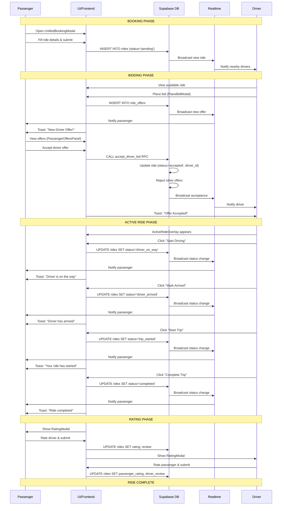
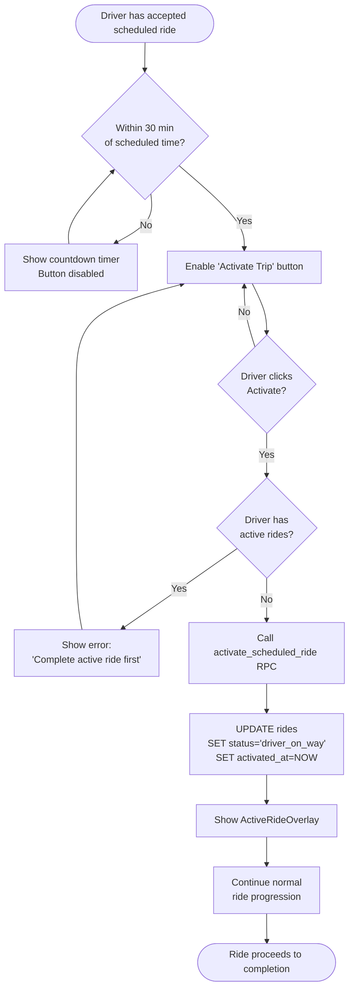
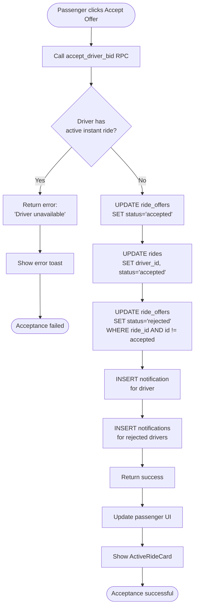
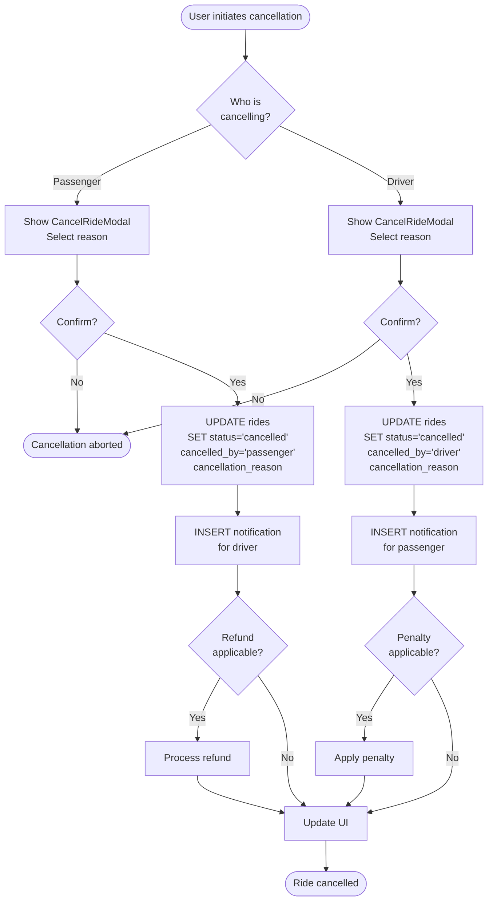
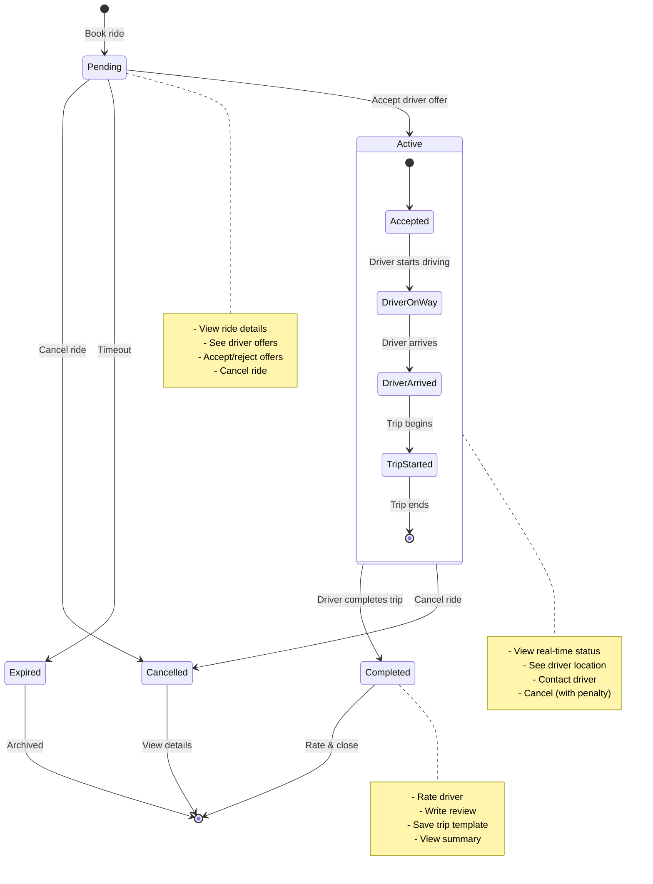
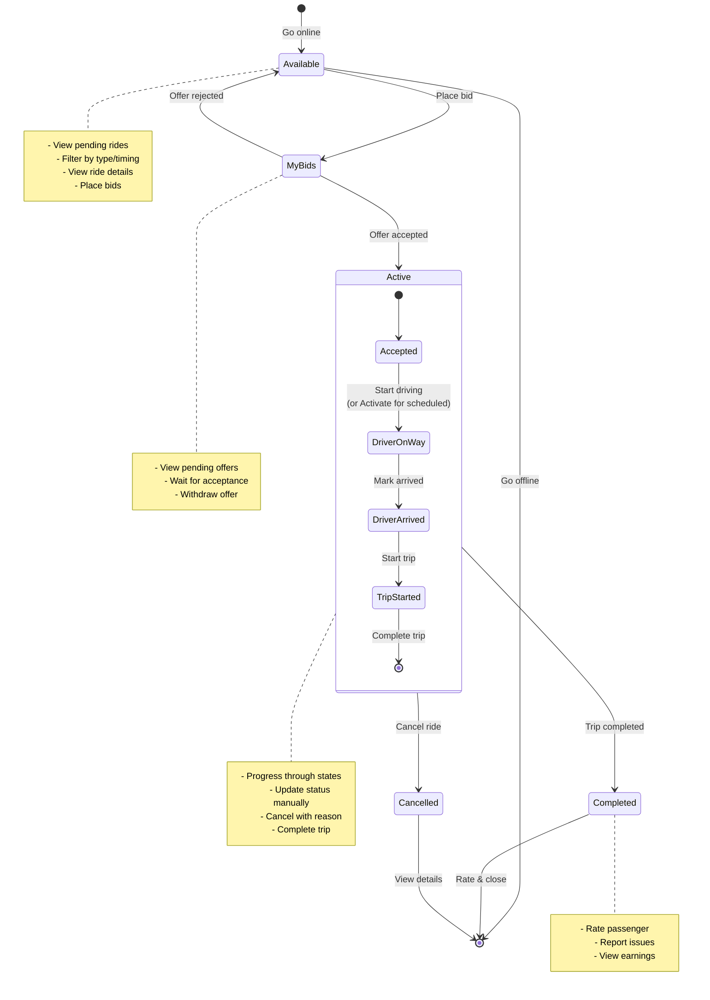
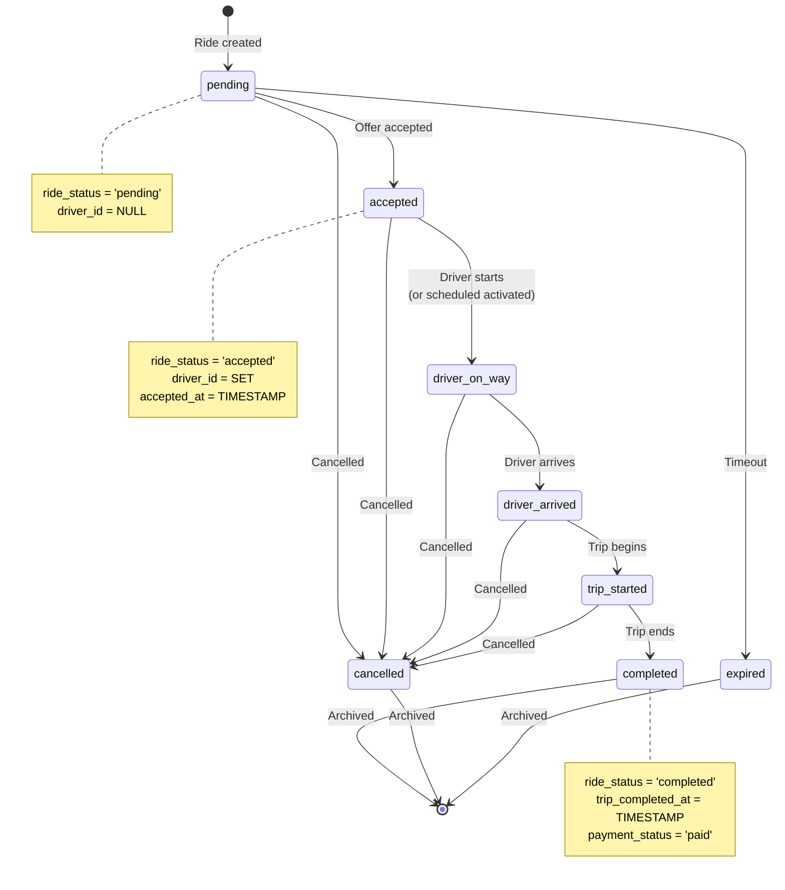

# TaxiCab PWA Platform - Ride Management System Analysis & Implementation Guide

**Document Version:** 1.0  
**Date:** 2025-11-21  
**Focus:** Individual/Passenger and Driver User Journeys  
**Status:** Comprehensive Analysis & Implementation Guide

---

## Table of Contents

1. [Executive Summary](#executive-summary)
2. [Platform Overview](#platform-overview)
3. [Database Schema](#database-schema)
4. [User Journeys](#user-journeys)
5. [Process Flow Diagrams](#process-flow-diagrams)
6. [State Transition Diagrams](#state-transition-diagrams)
7. [Code Analysis Report](#code-analysis-report)
8. [Problems & Inconsistencies](#problems--inconsistencies)
9. [Proposed Solutions](#proposed-solutions)
10. [Implementation Roadmap](#implementation-roadmap)

---

## 1. Executive Summary

### Platform Purpose
TaxiCab is a Progressive Web Application (PWA) e-hailing platform offering multiple transportation and delivery services with flexible scheduling options. The platform uses an inDrive-style bidding model where drivers submit offers and passengers accept them.

### Key Findings

**✅ Strengths:**
- Comprehensive database schema with 80+ fields in rides table
- Real-time updates via Supabase subscriptions
- Atomic bid acceptance preventing double-booking
- Clear ride status progression with history tracking
- Multiple service types and scheduling options

**⚠️ Critical Issues:**
- **Multiple notification systems** causing duplication and inconsistency
- **Incomplete ride completion flows** blocking user experience
- **Inconsistent status field usage** (ride_status vs status)
- **Duplicated code** across passenger and driver components
- **Missing state transition validations** in some flows
- **Unclear visual indicators** for ride states and sub-states

### Impact Assessment
- **User Experience:** Moderate - Users can complete rides but experience notification inconsistencies
- **Data Integrity:** Good - Database constraints and RPC functions ensure consistency
- **Code Maintainability:** Needs Improvement - Duplication and inconsistency increase technical debt
- **Scalability:** Good - Architecture supports growth with proper refactoring

---

## 2. Platform Overview

### 2.1 Service Types

| Service Type | Description | Unique Features |
|-------------|-------------|-----------------|
| **Taxi** | Standard passenger transport | Round-trip option, multiple passengers |
| **Courier** | Package delivery | Package size options, recipient details |
| **Errands** | Multiple stop tasks | Chain of pickup/dropoff locations |
| **School Run** | Student transportation | Recurring schedules, guardian info |
| **Work Run** | Commuter transport | Recurring schedules, corporate accounts |

### 2.2 Scheduling Options

| Type | Description | Availability | Use Case |
|------|-------------|--------------|----------|
| **Instant** | Immediate ride | All users | On-demand transportation |
| **Scheduled Single** | One-time future ride | All users | Airport pickups, appointments |
| **Scheduled Recurring** | Repeating rides | All users | Daily commutes, school runs |
| **Bulk Trips** | Multiple rides at once | Corporate only | Employee transportation |

### 2.3 User Types

1. **Individual/Passenger** - Regular users booking rides
2. **Driver** - Service providers accepting ride requests
3. **Corporate** - Companies managing employee transportation
4. **Operator** - Fleet managers (Coming Soon)

---

## 3. Database Schema

### 3.1 Core Tables

#### rides Table (Main Entity)
**80+ columns including:**

**Core Fields:**
- `id` (UUID, PK)
- `user_id` (UUID, FK → profiles)
- `driver_id` (UUID, FK → profiles, nullable)
- `vehicle_id` (UUID, FK → vehicles, nullable)

**Location Fields:**
- `pickup_location` (TEXT)
- `pickup_lat`, `pickup_lng` (NUMERIC)
- `pickup_coordinates` (JSONB/GeoJSON)
- `dropoff_location` (TEXT)
- `dropoff_lat`, `dropoff_lng` (NUMERIC)
- `dropoff_coordinates` (JSONB/GeoJSON)

**Status Fields:**
- `ride_status` (VARCHAR) - **Primary status field**
  - Values: `pending`, `accepted`, `driver_on_way`, `driver_arrived`, `trip_started`, `completed`, `cancelled`
  - Default: `pending`
- `driver_status` (VARCHAR)
- `acceptance_status` (VARCHAR)
- `payment_status` (VARCHAR)

**Timing Fields:**
- `ride_timing` (VARCHAR) - **Scheduling type**
  - Values: `instant`, `scheduled_single`, `scheduled_recurring`
  - Default: `instant`
- `scheduled_datetime` (TIMESTAMP)
- `scheduled_time` (TIME)

**Recurrence Fields:**
- `recurrence_pattern` (JSONB)
- `total_rides_in_series` (INTEGER)
- `completed_rides_count` (INTEGER)
- `remaining_rides_count` (INTEGER)
- `series_id` (UUID, FK → recurring_trip_series)

**Timestamps:**
- `created_at` (TIMESTAMP)
- `accepted_at` (TIMESTAMP)
- `trip_started_at` (TIMESTAMP)
- `trip_completed_at` (TIMESTAMP)
- `cancelled_at` (TIMESTAMP)
- `status_updated_at` (TIMESTAMP)

**Service Fields:**
- `service_type` (VARCHAR) - taxi, courier, errands, school_run, work_run
- `ride_type` (VARCHAR)

**Cancellation Fields:**
- `cancelled_by` (VARCHAR) - passenger, driver
- `cancellation_reason` (TEXT)

**Rating Fields:**
- `rating` (INTEGER) - Passenger rating of driver (1-5)
- `review` (TEXT) - Passenger review
- `rated_at` (TIMESTAMP)
- `passenger_rating` (INTEGER) - Driver rating of passenger (1-5)
- `driver_review` (TEXT) - Driver review
- `driver_rated_at` (TIMESTAMP)

#### ride_offers Table (Bidding System)

**Fields:**
- `id` (UUID, PK)
- `ride_id` (UUID, FK → rides)
- `driver_id` (UUID, FK → profiles)
- `quoted_price` (NUMERIC)
- `estimated_arrival_time` (INTEGER) - Minutes
- `offer_status` (VARCHAR)
  - Values: `pending`, `accepted`, `rejected`
  - Default: `pending`
- `offered_at` (TIMESTAMP)
- `responded_at` (TIMESTAMP)
- `accepted_at` (TIMESTAMP)
- `rejected_at` (TIMESTAMP)
- `message` (TEXT) - Optional driver message

**Indexes:**
- `idx_ride_offers_ride_id` ON (ride_id)
- `idx_ride_offers_driver_id` ON (driver_id)
- `idx_ride_offers_status` ON (offer_status)

#### notifications Table

**Fields:**
- `id` (UUID, PK)
- `user_id` (UUID, FK → profiles)
- `title` (VARCHAR)
- `message` (TEXT)
- `type` (VARCHAR) - ride, payment, system
- `read` (BOOLEAN) - Default: false
- `action_url` (VARCHAR) - Deep link
- `created_at` (TIMESTAMP)

#### ride_status_history Table (Audit Trail)

**Fields:**
- `id` (UUID, PK)
- `ride_id` (UUID, FK → rides)
- `old_status` (VARCHAR)
- `new_status` (VARCHAR)
- `changed_by` (UUID, FK → profiles)
- `notes` (TEXT)
- `created_at` (TIMESTAMP)

#### scheduled_trips Table (Corporate)

**Purpose:** Corporate scheduled trips management
**Key Fields:** user_id, passenger_id, pickup/dropoff details, schedule info

#### recurring_trip_series Table

**Purpose:** Manage recurring ride series
**Key Fields:**
- `id` (UUID, PK)
- `user_id` (UUID)
- `driver_id` (UUID, nullable)
- `series_name` (VARCHAR)
- `recurrence_pattern` (VARCHAR) - daily, weekly, weekdays, weekends, custom
- `recurrence_days` (INTEGER[]) - Array of day numbers (0=Sunday, 6=Saturday)
- `start_date`, `end_date` (TIMESTAMP)
- `trip_time` (TIME)
- `status` (VARCHAR) - active, paused, completed, cancelled
- `total_trips`, `completed_trips`, `remaining_trips` (INTEGER)
- `next_trip_date` (TIMESTAMP)

#### saved_trips Table

**Purpose:** User-saved trip templates for quick rebooking
**Key Fields:**
- `id` (UUID, PK)
- `user_id` (UUID, FK → profiles)
- `trip_name` (VARCHAR)
- `service_type` (VARCHAR)
- `pickup_location`, `dropoff_location` (TEXT)
- `pickup_lat`, `pickup_lng`, `dropoff_lat`, `dropoff_lng` (NUMERIC)
- `usage_count` (INTEGER) - Default: 0
- `last_used` (TIMESTAMP)
- `created_at` (TIMESTAMP)

### 3.2 Database Functions (RPCs)

#### accept_driver_bid
**Purpose:** Atomic bid acceptance preventing double-booking
**Parameters:** ride_id, offer_id, driver_id, passenger_id
**Logic:**
1. Check driver has no active instant rides
2. Accept the offer
3. Update ride with driver assignment
4. Reject all other pending offers
5. Return success/error

#### get_driver_rides
**Purpose:** Single source of truth for driver ride queries
**Parameters:**
- p_driver_id (UUID)
- p_status_group (VARCHAR) - AVAILABLE, BID, ACTIVE, COMPLETED
- p_ride_type (VARCHAR, nullable) - Filter by service type
- p_schedule_type (VARCHAR, nullable) - Filter by timing
- p_limit, p_offset (INTEGER) - Pagination

**Returns:** Filtered and paginated ride list

#### get_active_instant_ride
**Purpose:** Check for active instant rides (priority check)
**Parameters:** p_driver_id (UUID)
**Returns:** Active instant ride or null

#### get_imminent_scheduled_rides
**Purpose:** Find scheduled rides starting soon
**Parameters:**
- p_driver_id (UUID)
- p_window_minutes (INTEGER) - Default: 30

**Returns:** Scheduled rides within time window

#### activate_scheduled_ride
**Purpose:** Activate scheduled ride with validation
**Parameters:**
- p_ride_id (UUID)
- p_driver_id (UUID)

**Logic:**
1. Validate no active rides exist
2. Update ride status to 'driver_on_way'
3. Set activated_at timestamp
4. Return success/error

---

## 4. User Journeys

### 4.1 Individual/Passenger Journey

#### Overview
Passengers interact with 5 main ride states through the IndividualRidesPage component with tabbed interface.

#### State 1: PENDING (Awaiting Driver Offers)

**Entry Point:** After booking a ride via UnifiedBookingModal

**User Actions:**
- View ride details
- See incoming driver offers in real-time
- Accept/reject driver offers
- Cancel ride

**System Behavior:**
- Broadcast ride to nearby drivers
- Collect driver offers in ride_offers table
- Send real-time notifications for new offers
- Display offer count badge on ride card

**UI Components:**
- `PendingRideCard` - Shows ride summary with offer count
- `PassengerOffersPanel` - Lists driver offers with accept/reject buttons
- `RideDetailsModal` - Full ride details with offers timeline

**Notifications:**
- Toast: "🎉 New Driver Offer! X new offers received for your [service_type]"
- Sound: notification.mp3 (optional)
- Badge: Offer count on ride card

**Database State:**
- `ride_status`: `pending`
- `driver_id`: NULL
- `ride_offers`: Multiple rows with `offer_status='pending'`

**Exit Conditions:**
- ✅ Accept offer → Move to ACTIVE state
- ❌ Cancel ride → Move to CANCELLED state
- ⏱️ Ride expires (instant: 30 min, scheduled: past scheduled time) → Expired

#### State 2: ACTIVE (Ride in Progress)

**Entry Point:** After accepting a driver offer

**Sub-States:**
1. **accepted** - Driver confirmed, preparing to start
2. **driver_on_way** - Driver heading to pickup location
3. **driver_arrived** - Driver at pickup location
4. **trip_started** - Journey in progress

**User Actions:**
- View real-time ride status
- See driver location (if implemented)
- Contact driver (if implemented)
- Cancel ride (with penalty/reason)

**System Behavior:**
- Driver updates status through ActiveRideOverlay
- Each status change triggers notification to passenger
- Real-time subscription updates UI
- Track timestamps for each sub-state

**UI Components:**
- `ActiveRideCard` - Shows current status with progress indicator
- `ActiveRidesView` - Manages active rides and rating modal
- Status progression stepper (visual indicator)

**Notifications (Per Sub-State):**
- **accepted**: "Driver accepted your ride"
- **driver_on_way**: "Driver is on the way"
- **driver_arrived**: "Driver has arrived at pickup"
- **trip_started**: "Your ride has started"

**Database State:**
- `ride_status`: `accepted` | `driver_on_way` | `driver_arrived` | `trip_started`
- `driver_id`: Set to accepted driver
- `accepted_at`: Timestamp when offer accepted
- `trip_started_at`: Timestamp when journey begins

**Exit Conditions:**
- ✅ Trip completes → Move to COMPLETED state
- ❌ Cancelled by passenger/driver → Move to CANCELLED state

#### State 3: COMPLETED (Trip Finished)

**Entry Point:** Driver marks trip as completed

**User Actions:**
- Rate driver (1-5 stars)
- Write review (optional)
- Save trip as template (optional)
- View trip summary

**System Behavior:**
- Show rating modal automatically
- Update ride with rating and review
- Optionally save to saved_trips table
- Mark payment as paid
- Calculate driver earnings

**UI Components:**
- `RatingModal` - Star rating, review text, save trip checkbox
- `CompletedRideCard` - Shows trip summary with rating

**Notifications:**
- Toast: "Ride completed" (success)
- Modal: Rating prompt appears automatically

**Database State:**
- `ride_status`: `completed`
- `trip_completed_at`: Timestamp
- `payment_status`: `paid`
- `rating`: 1-5 (after user rates)
- `review`: TEXT (optional)
- `rated_at`: Timestamp when rated

**Exit Conditions:**
- User rates and closes modal → Ride archived
- User dismisses modal → Can rate later from Completed tab

#### State 4: CANCELLED (Ride Cancelled)

**Entry Point:** User or driver cancels ride

**User Actions:**
- View cancellation reason
- Rebook similar ride
- View refund status (if applicable)

**System Behavior:**
- Record cancellation details
- Send notification to other party
- Process refund if applicable
- Update ride status history

**UI Components:**
- `CancelledRideCard` - Shows cancellation info
- `CancelRideModal` - Cancellation reason selection (if user cancels)

**Cancellation Reasons (Passenger):**
- Changed plans
- Found alternative transport
- Driver taking too long
- Price issue
- Other

**Notifications:**
- To driver: "❌ Ride cancelled - Your ride has been cancelled by the passenger"
- To passenger: "❌ Ride cancelled - Your ride has been cancelled by the driver"

**Database State:**
- `ride_status`: `cancelled`
- `cancelled_at`: Timestamp
- `cancelled_by`: `passenger` | `driver`
- `cancellation_reason`: TEXT

**Exit Conditions:**
- Ride remains in cancelled state (archived)

#### State 5: SAVED (Trip Templates)

**Entry Point:** User saves trip during rating or from booking modal

**User Actions:**
- View saved trips
- Use saved trip to create new booking
- Edit saved trip
- Delete saved trip

**System Behavior:**
- Store trip template in saved_trips table
- Track usage count
- Pre-fill booking form when selected

**UI Components:**
- `SavedTripCard` - Shows saved trip with usage count
- `UnifiedBookingModal` - "Saved" tab shows saved trips

**Database State:**
- Separate `saved_trips` table entry
- `usage_count`: Incremented each time used
- `last_used`: Updated on each use

**Exit Conditions:**
- User deletes saved trip → Removed from saved_trips table

---

### 4.2 Driver Journey

#### Overview
Drivers interact with 4 main ride states through the DriverRidesPage component with unified feed system.

#### State 1: AVAILABLE (Rides to Bid On)

**Entry Point:** Driver goes online, pending rides appear

**User Actions:**
- View available rides
- Filter by service type, timing
- View ride details
- Place bid (submit offer)

**System Behavior:**
- Show only rides without existing offer from this driver
- Real-time subscription for new rides
- Calculate distance to pickup
- Show estimated earnings

**UI Components:**
- `DriverRidesPage` - Main container with tabs
- `RideList` - Displays available rides
- `PlaceBidModal` - Bid submission form (quoted price, ETA, message)
- `DriverRideDetailsModal` - Full ride details

**Filters:**
- Service Type: All, Taxi, Courier, Errands, School Run, Work Run
- Timing: All, Instant, Scheduled, Recurring

**Notifications:**
- Toast: "🚗 New rides available! X new rides match your criteria"
- Badge: New ride count indicator

**Database State:**
- `ride_status`: `pending`
- `driver_id`: NULL
- No offer from this driver in ride_offers table

**Exit Conditions:**
- ✅ Place bid → Move to MY BIDS state
- ⏱️ Ride accepted by another driver → Removed from available

#### State 2: MY BIDS (Pending Offers)

**Entry Point:** After placing a bid on a ride

**User Actions:**
- View pending offers
- Wait for passenger acceptance
- Withdraw offer (if implemented)

**System Behavior:**
- Show rides with pending offers from this driver
- Real-time updates when offer accepted/rejected
- Notify driver of acceptance

**UI Components:**
- `RideList` - Shows rides with "Pending" badge
- `DriverRideDetailsModal` - Shows offer details

**Notifications:**
- Offer accepted: "✅ Offer Accepted! Your offer for [service_type] ride was accepted"
- Offer rejected: "❌ Offer Declined - Passenger chose another driver"

**Database State:**
- `ride_status`: `pending`
- `ride_offers`: Row with `offer_status='pending'` for this driver

**Exit Conditions:**
- ✅ Offer accepted → Move to ACTIVE state
- ❌ Offer rejected → Removed from bids
- ❌ Passenger accepts another driver → Removed from bids

#### State 3: ACTIVE (Accepted Rides)

**Entry Point:** Passenger accepts driver's offer

**Sub-States:**
1. **accepted** - Ride confirmed, driver preparing
2. **driver_on_way** - Heading to pickup
3. **driver_arrived** - At pickup location
4. **trip_started** - Journey in progress

**User Actions:**
- **For scheduled rides:** Activate trip (within 30 min window)
- **For all rides:** Progress through sub-states
- Update status manually via buttons
- Cancel ride (with reason)
- Complete trip

**System Behavior:**
- Show ActiveRideOverlay modal (priority display)
- Track status progression
- Send notifications to passenger on each update
- Validate status transitions
- Update driver availability

**UI Components:**
- `ActiveRideOverlay` - Modal with status stepper and action buttons
- `ScheduledRidesView` - Shows scheduled rides with activate button
- `CancelRideModal` - Cancellation reason selection

**Status Progression Buttons:**
- **accepted** → "Start Driving" → **driver_on_way**
- **driver_on_way** → "Mark Arrived" → **driver_arrived**
- **driver_arrived** → "Start Trip" → **trip_started**
- **trip_started** → "Complete Trip" → **completed**

**Scheduled Ride Activation:**
- Can activate within 30 minutes of scheduled time
- Activation transitions to `driver_on_way` status
- Shows countdown timer until activation available

**Notifications (To Passenger):**
- Each status change triggers notification
- Inserted into notifications table
- Real-time broadcast via Supabase

**Database State:**
- `ride_status`: `accepted` | `driver_on_way` | `driver_arrived` | `trip_started`
- `driver_id`: Set to this driver
- `accepted_at`: Timestamp
- `trip_started_at`: Timestamp (when trip_started)
- `status_updated_at`: Updated on each transition

**Validation:**
- Status transitions must follow sequence
- Cannot skip states
- Timestamps recorded for each transition

**Exit Conditions:**
- ✅ Complete trip → Move to COMPLETED state
- ❌ Cancel ride → Move to CANCELLED state

#### State 4: COMPLETED (Finished Trips)

**Entry Point:** Driver marks trip as completed

**User Actions:**
- Rate passenger (1-5 stars)
- Write review (optional)
- Report issues (payment, behavior, cleanliness)
- View trip summary
- View earnings

**System Behavior:**
- Show RatingModal automatically
- Update ride with driver's rating of passenger
- Create complaint record if issues reported
- Calculate and display earnings
- Update driver availability to available

**UI Components:**
- `RatingModal` - Star rating, review, issue checkboxes
- Completed rides list in Completed tab

**Notifications:**
- To passenger: "Ride completed"
- Rating modal appears for driver

**Database State:**
- `ride_status`: `completed`
- `trip_completed_at`: Timestamp
- `completed_at`: Timestamp
- `payment_status`: `paid`
- `passenger_rating`: 1-5 (driver's rating of passenger)
- `driver_review`: TEXT (optional)
- `driver_rated_at`: Timestamp
- `driver_reported_issues`: ARRAY (if issues reported)

**Earnings Calculation:**
- Total Fare: `fare` or `estimated_cost`
- Platform Commission: 15%
- Driver Earnings: Fare - Commission

**Exit Conditions:**
- Driver rates and closes modal → Ride archived
- Driver dismisses modal → Can rate later

---

## 5. Process Flow Diagrams

### 5.1 Complete Ride Lifecycle (Passenger + Driver)



### 5.2 Scheduled Ride Activation Flow



### 5.3 Bid Acceptance Flow (Atomic)



### 5.4 Cancellation Flow



---

## 6. State Transition Diagrams

### 6.1 Passenger Ride States



### 6.2 Driver Ride States



### 6.3 Ride Status Progression (Database)



---

## 7. Code Analysis Report

### 7.1 Component Architecture

#### Passenger Components

| Component | Path | Purpose | Status |
|-----------|------|---------|--------|
| **IndividualRidesPage** | `src/dashboards/client/pages/` | Main rides page with tabs | ✅ Good |
| **UnifiedBookingModal** | `src/dashboards/client/components/` | Ride booking interface | ✅ Good |
| **PendingRideCard** | `src/dashboards/client/components/` | Pending ride display | ✅ Good |
| **ActiveRideCard** | `src/dashboards/client/components/` | Active ride display | ✅ Good |
| **CompletedRideCard** | `src/dashboards/client/components/` | Completed ride display | ✅ Good |
| **CancelledRideCard** | `src/dashboards/client/components/` | Cancelled ride display | ✅ Good |
| **SavedTripCard** | `src/dashboards/client/components/` | Saved trip template | ✅ Good |
| **PassengerOffersPanel** | `src/dashboards/client/components/` | Driver offers list | ✅ Good |
| **RideDetailsModal** | `src/dashboards/client/components/` | Full ride details | ✅ Good |
| **ActiveRidesView** | `src/dashboards/client/components/` | Active rides manager | ⚠️ Complex |
| **RatingModal** | `src/dashboards/client/components/` | Passenger rating | ✅ Good |
| **CancelRideModal** | `src/dashboards/client/components/` | Cancellation reasons | ✅ Good |

#### Driver Components

| Component | Path | Purpose | Status |
|-----------|------|---------|--------|
| **DriverRidesPage** | `src/dashboards/driver/` | Main container | ✅ Good |
| **DriverRidesHub** | `src/dashboards/driver/components/` | Legacy hub (deprecated) | ⚠️ Duplicate |
| **ActiveRideOverlay** | `src/dashboards/driver/components/` | Active ride modal | ✅ Good |
| **PlaceBidModal** | `src/dashboards/driver/components/` | Bid submission | ✅ Good |
| **DriverRideDetailsModal** | `src/dashboards/driver/components/` | Ride details | ✅ Good |
| **RatingModal** | `src/dashboards/driver/components/` | Driver rating | ✅ Good |
| **CancelRideModal** | `src/dashboards/driver/components/` | Cancellation reasons | ✅ Good |
| **ScheduledRidesView** | `src/dashboards/driver/components/` | Scheduled rides | ✅ Good |
| **RidesTabs** | `src/dashboards/driver/components/` | Tab navigation | ✅ Good |
| **RideList** | `src/dashboards/driver/components/` | Ride cards list | ✅ Good |

### 7.2 Hooks & Services

#### Hooks

| Hook | Path | Purpose | Status |
|------|------|---------|--------|
| **useDriverRidesFeed** | `src/hooks/` | Driver rides data fetching | ✅ Good |
| **useActiveRideCheck** | `src/hooks/` | Active ride priority check | ✅ Good |
| **useNewRidesSubscription** | `src/hooks/` | Real-time new rides | ✅ Good |
| **useRideNotifications** | `src/hooks/` | Ride notifications | ⚠️ Overlaps |
| **useRideRealtime** | `src/hooks/` | Generic realtime | ⚠️ Overlaps |

#### Services

| Service | Path | Purpose | Status |
|---------|------|---------|--------|
| **driverRidesApi** | `src/services/` | Driver ride operations | ✅ Good |
| **bidAcceptanceService** | `src/services/` | Atomic bid acceptance | ✅ Good |
| **reminderService** | `src/services/` | Scheduled reminders | ✅ Good |
| **recurringTripService** | `src/services/` | Recurring trips | ✅ Good |

### 7.3 Notification Systems

**⚠️ CRITICAL ISSUE: Multiple Overlapping Notification Systems**

| System | Location | Purpose | Issues |
|--------|----------|---------|--------|
| **RideStatusToasts** | `src/components/notifications/` | Lightweight status toasts | ✅ Works but overlaps |
| **NotificationBell** | `src/components/notifications/` | Bell icon with ride watching | ⚠️ Duplicates functionality |
| **useRideNotifications** | `src/hooks/` | Hook for notifications | ⚠️ Overlaps with components |
| **Direct DB Inserts** | `ActiveRideOverlay`, etc. | Manual notification inserts | ⚠️ Inconsistent |

**Problems:**
1. **Duplication**: Same notifications triggered multiple times
2. **Inconsistency**: Different notification formats/messages
3. **Maintenance**: Changes must be made in multiple places
4. **Debugging**: Hard to trace notification source

---

## 8. Problems & Inconsistencies

### 8.1 Critical Issues

#### Issue 1: Multiple Notification Systems
**Severity:** HIGH
**Impact:** User Experience, Code Maintainability

**Description:**
The platform has 4 different notification systems that overlap:
- RideStatusToasts component (Supabase subscription)
- NotificationBell component (Supabase subscription + ride watching)
- useRideNotifications hook
- Direct notification inserts in components

**Evidence:**
- `RideStatusToasts.jsx` subscribes to ride updates and shows toasts
- `NotificationBell.jsx` also subscribes to ride updates
- `ActiveRideOverlay.jsx` manually inserts notifications
- `useRideNotifications.js` provides another subscription layer

**Consequences:**
- Duplicate notifications shown to users
- Inconsistent notification messages
- Performance overhead (multiple subscriptions)
- Difficult to debug notification issues

**Affected Files:**
- `src/components/notifications/RideStatusToasts.jsx`
- `src/components/notifications/NotificationBell.jsx`
- `src/hooks/useRideNotifications.js`
- `src/dashboards/driver/components/ActiveRideOverlay.jsx`

#### Issue 2: Inconsistent Status Field Usage
**Severity:** MEDIUM
**Impact:** Data Integrity, Code Clarity

**Description:**
Code uses both `ride_status` and `status` fields inconsistently.

**Evidence:**
```javascript
// In RideStatusToasts.jsx line 52
const curr = ride.ride_status || ride.status;

// In database.js line 142
status: 'cancelled'  // Should be ride_status

// In ridesStore.js line 239
ride_status: mappedStatus  // Correct
```

**Consequences:**
- Confusion about which field to use
- Potential bugs when field is missing
- Database queries may fail

**Affected Files:**
- `src/components/notifications/RideStatusToasts.jsx`
- `src/lib/database.js`
- `src/stores/ridesStore.js`
- Multiple component files

#### Issue 3: Incomplete Ride Completion Flow
**Severity:** MEDIUM
**Impact:** User Experience

**Description:**
Rating modal logic is complex and spread across multiple components.

**Evidence:**
- `ActiveRidesView.jsx` manages rating modal state
- Checks for `rated_at` field
- Uses `ratedRideIds` Set to prevent duplicates
- Modal can appear multiple times if not handled correctly

**Consequences:**
- Users may see rating modal multiple times
- Rating may not be saved correctly
- Confusing user experience

**Affected Files:**
- `src/dashboards/client/components/ActiveRidesView.jsx`
- `src/dashboards/client/components/RatingModal.jsx`
- `src/dashboards/driver/components/RatingModal.jsx`

### 8.2 Critical Issues - Ride Completion Failure

#### Issue 4: Ride Completion Button Failure (BLOCKING)
**Severity:** CRITICAL
**Impact:** User Experience - Drivers Cannot Complete Rides
**Status:** IDENTIFIED - Requires Immediate Fix

**Root Cause:**
The ride completion button in `ActiveRideOverlay.jsx` fails due to TWO critical mismatches between code and database:

1. **Status Value Mismatch:**
   - **Code uses:** `'completed'` (line 117, 144, 202)
   - **Database expects:** `'trip_completed'` (per constraint check)
   - **Database Constraint:** `CHECK ((ride_status = ANY (ARRAY['pending'::text, 'accepted'::text, 'driver_on_way'::text, 'driver_arrived'::text, 'trip_started'::text, 'trip_completed'::text, 'cancelled'::text])))`

2. **Field Name Mismatch:**
   - **Code sets:** `completed_at` (line 147)
   - **Database has:** `trip_completed_at`
   - **Result:** Field doesn't exist, causing database update to fail

**Evidence:**

File: `src/dashboards/driver/components/ActiveRideOverlay.jsx`

```javascript
// Line 117 - WRONG STATUS VALUE
trip_started: { label: 'Complete Trip', status: 'completed', variant: 'success' },
// Should be: status: 'trip_completed'

// Lines 125-132 - WRONG STATUS IN VALIDATION
const allowedFrom = {
  driver_on_way: 'accepted',
  driver_arrived: 'driver_on_way',
  trip_started: 'driver_arrived',
  completed: 'trip_started',  // ❌ Should be 'trip_completed'
};

// Lines 144-148 - WRONG FIELD NAME AND STATUS
} else if (newStatus === 'completed') {  // ❌ Should be 'trip_completed'
  updateData.actual_dropoff_time = new Date().toISOString();
  updateData.payment_status = 'paid';
  updateData.completed_at = new Date().toISOString();  // ❌ Should be 'trip_completed_at'
}

// Line 202 - WRONG STATUS CHECK
if (newStatus === 'completed') {  // ❌ Should be 'trip_completed'
```

**Impact:**
- ❌ Database update fails when driver clicks "Complete Trip"
- ❌ Ride remains stuck in `trip_started` status
- ❌ Driver cannot complete rides
- ❌ Driver availability not updated
- ❌ Passengers don't receive completion notification
- ❌ Rating modal never appears for passengers
- ❌ Payment status not updated to 'paid'
- ❌ Driver cannot accept new rides

**Affected Files:**
1. `src/dashboards/driver/components/ActiveRideOverlay.jsx` (PRIMARY - 4 locations)
2. `src/dashboards/client/components/RideDetailsModal.jsx` (lines 26, 394)
3. `src/dashboards/client/components/ActiveRidesView.jsx` (line 107)
4. `src/components/notifications/RideStatusToasts.jsx` (line 58)

**Inconsistent Status Usage Across Codebase:**
- ✅ `src/stores/ridesStore.js` - CORRECTLY uses `'trip_completed'` (lines 248-249, 264)
- ✅ `src/stores/driverStore.js` - CORRECTLY uses `'trip_completed'` (line 110)
- ❌ `src/dashboards/driver/components/ActiveRideOverlay.jsx` - INCORRECTLY uses `'completed'`
- ❌ `src/dashboards/client/components/RideDetailsModal.jsx` - INCORRECTLY uses `'completed'`
- ❌ `src/dashboards/client/components/ActiveRidesView.jsx` - INCORRECTLY uses `'completed'`
- ❌ `src/components/notifications/RideStatusToasts.jsx` - INCORRECTLY uses `'completed'`

**Fix Required:**

**File 1: `src/dashboards/driver/components/ActiveRideOverlay.jsx`**
```javascript
// Line 117 - Fix status value
trip_started: { label: 'Complete Trip', status: 'trip_completed', variant: 'success' },

// Lines 125-132 - Fix validation
const allowedFrom = {
  driver_on_way: 'accepted',
  driver_arrived: 'driver_on_way',
  trip_started: 'driver_arrived',
  trip_completed: 'trip_started',
};

// Lines 144-148 - Fix field name and status
} else if (newStatus === 'trip_completed') {
  updateData.actual_dropoff_time = new Date().toISOString();
  updateData.payment_status = 'paid';
  updateData.trip_completed_at = new Date().toISOString();
}

// Line 202 - Fix status check
if (newStatus === 'trip_completed') {
```

**File 2: `src/dashboards/client/components/RideDetailsModal.jsx`**
```javascript
// Line 26
if (isOpen && autoOpenRating && ride?.ride_status === 'trip_completed' && !ride?.rating) {

// Line 394
{ride?.ride_status === 'trip_completed' && !ride?.rating && (
```

**File 3: `src/dashboards/client/components/ActiveRidesView.jsx`**
```javascript
// Line 107
.eq('ride_status', 'trip_completed')
```

**File 4: `src/components/notifications/RideStatusToasts.jsx`**
```javascript
// Line 58
type: curr === 'trip_completed' ? 'success' : 'info',
```

**File 5: `src/dashboards/driver/components/ActiveRideOverlay.jsx` (Notification Messages)**
```javascript
// Add to notificationMessages object
const notificationMessages = {
  driver_on_way: { title: '🚗 Driver on the way', message: 'Your driver is heading to your pickup location' },
  driver_arrived: { title: '📍 Driver arrived', message: 'Your driver has arrived at the pickup location' },
  trip_started: { title: '🎯 Trip started', message: 'Your trip has begun. Have a safe journey!' },
  trip_completed: { title: '✅ Trip completed', message: 'Your trip has been completed. Please rate your experience!' }
};
```

**Testing Steps:**
1. Driver accepts a ride
2. Driver progresses through: driver_on_way → driver_arrived → trip_started
3. Driver clicks "Complete Trip" button
4. ✅ Verify database update succeeds
5. ✅ Verify ride_status = 'trip_completed'
6. ✅ Verify trip_completed_at timestamp is set
7. ✅ Verify payment_status = 'paid'
8. ✅ Verify driver availability updated to true
9. ✅ Verify passenger receives completion notification
10. ✅ Verify rating modal appears for passenger

**Priority:** P0 - CRITICAL - Must fix immediately

---

### 8.3 Medium Priority Issues

#### Issue 5: Duplicated Code Between Passenger and Driver
**Severity:** MEDIUM
**Impact:** Code Maintainability

**Description:**
Similar components exist for both passenger and driver with duplicated logic.

**Duplicate Components Identified:**

1. **CancelRideModal** - Two separate implementations:
   - `src/dashboards/client/components/CancelRideModal.jsx` (70 lines)
     - Reasons: Change of plans, Booked by mistake, Found alternative, Driver taking too long, Price too high, Other
     - UI: Grid layout with buttons
     - Default: 'Change of plans'
   - `src/dashboards/driver/components/CancelRideModal.jsx` (79 lines)
     - Reasons: Passenger no-show, Passenger requested, Vehicle issue, Traffic/delay, Price issue, Trip Completed, Other
     - UI: Radio buttons list
     - Default: 'Passenger no-show'

2. **RatingModal** - Two separate implementations with different fields:
   - `src/dashboards/client/components/RatingModal.jsx` (164 lines)
     - Fields: rating, review, saveTrip checkbox
     - Updates: `rating`, `review`, `rated_at`, `is_saved_template`
     - Purpose: Passenger rates driver
   - `src/dashboards/driver/components/RatingModal.jsx` (244 lines)
     - Fields: rating, review, issues (payment, behavior, cleanliness)
     - Updates: `passenger_rating`, `driver_review`, `driver_reported_issues`, `driver_rated_at`
     - Creates complaint records if issues reported
     - Purpose: Driver rates passenger

3. **DriverRidesHub.jsx** - DEPRECATED (732 lines)
   - Status: Replaced by DriverRidesPage.jsx
   - Still imports old view components: AvailableRidesView, PendingBidsView, ActiveRidesView (ActiveTripsView), CompletedRidesView
   - Migration doc says it should be deleted after verification
   - Currently unused but still in codebase

**Obsolete Components (Should be Removed):**
1. `src/dashboards/driver/components/AvailableRidesView.jsx` - Replaced by unified RideList
2. `src/dashboards/driver/components/PendingBidsView.jsx` - Replaced by unified RideList
3. `src/dashboards/driver/components/ActiveTripsView.jsx` - Replaced by unified RideList
4. `src/dashboards/driver/components/CompletedRidesView.jsx` - Replaced by unified RideList
5. `src/dashboards/driver/components/DriverRidesHub.jsx` - Replaced by DriverRidesPage

**Obsolete Documentation Files (Already in .gitignore):**
- APACHE_DEPLOYMENT_GUIDE.md
- DEPLOYMENT_SUMMARY.md
- OFFLINE_HANDLING_IMPLEMENTATION.md
- PROFILE_TYPE_VERIFICATION.md
- PWA_ASSET_GENERATION.md
- PWA_IMPLEMENTATION_GUIDE.md
- PWA_NEXT_STEPS.md
- PWA_TESTING_CHECKLIST.md
- STATUS_PAGE_VERIFICATION.md
- STORAGE_RLS_FIX.md
- VERIFICATION_FINDINGS.md
- MIGRATION_COMPLETE.md

**Obsolete Build Files:**
- vite.config.mjs.timestamp-1763175720477-99ed145279f3b8.mjs

**Consequences:**
- Bug fixes must be applied twice
- Inconsistent behavior between passenger and driver
- Increased maintenance burden
- Dead code bloating codebase
- Confusion about which components to use

**Recommendation:**
1. Create shared components with role-based rendering
2. Delete obsolete components after verification
3. Remove obsolete documentation files
4. Clean up build artifacts

#### Issue 6: DRY Principle Violations (Don't Repeat Yourself)
**Severity:** MEDIUM
**Impact:** Code Maintainability & Consistency

**Description:**
Significant code duplication across the codebase violating DRY principles.

**Violations Identified:**

**1. Status Transition Logic - Duplicated Across Multiple Files**

Locations:
- `src/dashboards/driver/components/ActiveRideOverlay.jsx` - Status validation and transitions
- `src/stores/ridesStore.js` - Status mapping logic (lines 240-260)
- Multiple components check for active statuses: `['accepted', 'driver_on_way', 'driver_arrived', 'trip_started']`
  - `src/dashboards/driver/components/DriverRidesHub.jsx` (line 371)
  - `src/dashboards/client/components/ActiveRidesView.jsx` (line 68)
  - `.kiro/specs/ride-management-enhancements/design.md` (line 975)

**Impact:**
- Status constants repeated in 5+ files
- Validation logic duplicated
- Changes require updates in multiple places
- Risk of inconsistency

**Solution:**
```javascript
// Create: src/hooks/useRideStatus.js
export const RIDE_STATUSES = {
  PENDING: 'pending',
  ACCEPTED: 'accepted',
  DRIVER_ON_WAY: 'driver_on_way',
  DRIVER_ARRIVED: 'driver_arrived',
  TRIP_STARTED: 'trip_started',
  TRIP_COMPLETED: 'trip_completed',
  CANCELLED: 'cancelled',
};

export const ACTIVE_STATUSES = [
  RIDE_STATUSES.ACCEPTED,
  RIDE_STATUSES.DRIVER_ON_WAY,
  RIDE_STATUSES.DRIVER_ARRIVED,
  RIDE_STATUSES.TRIP_STARTED,
];

export const STATUS_TRANSITIONS = {
  [RIDE_STATUSES.DRIVER_ON_WAY]: RIDE_STATUSES.ACCEPTED,
  [RIDE_STATUSES.DRIVER_ARRIVED]: RIDE_STATUSES.DRIVER_ON_WAY,
  [RIDE_STATUSES.TRIP_STARTED]: RIDE_STATUSES.DRIVER_ARRIVED,
  [RIDE_STATUSES.TRIP_COMPLETED]: RIDE_STATUSES.TRIP_STARTED,
};

export function useRideStatus() {
  const validateTransition = (from, to) => {
    return STATUS_TRANSITIONS[to] === from;
  };

  const isActiveStatus = (status) => {
    return ACTIVE_STATUSES.includes(status);
  };

  return { validateTransition, isActiveStatus, RIDE_STATUSES, ACTIVE_STATUSES };
}
```

**2. Notification Creation - Multiple Overlapping Systems**

Locations:
- Direct DB inserts in `ActiveRideOverlay.jsx` (lines 188-198)
- `src/components/notifications/RideStatusToasts.jsx` component
- `src/components/notifications/NotificationBell.jsx` component
- `src/hooks/useRideNotifications.js` hook

**Impact:**
- 4 different notification systems
- Duplication of subscription logic
- Inconsistent notification behavior
- Performance overhead from multiple subscriptions

**Solution:**
```javascript
// Create: src/services/notificationService.js
export class NotificationService {
  static async sendRideNotification(userId, rideId, status) {
    const messages = {
      driver_on_way: { title: '🚗 Driver on the way', message: 'Your driver is heading to your pickup location' },
      driver_arrived: { title: '📍 Driver arrived', message: 'Your driver has arrived at the pickup location' },
      trip_started: { title: '🎯 Trip started', message: 'Your trip has begun. Have a safe journey!' },
      trip_completed: { title: '✅ Trip completed', message: 'Your trip has been completed. Please rate your experience!' }
    };

    const notification = messages[status];
    if (!notification) return;

    const { error } = await supabase.from('notifications').insert({
      user_id: userId,
      title: notification.title,
      message: notification.message,
      type: 'ride',
      action_url: `/user/rides/${rideId}`,
      created_at: new Date().toISOString()
    });

    if (error) {
      console.error('Error sending notification:', error);
      throw error;
    }
  }
}
```

**3. Ride Completion Logic - Spread Across Multiple Files**

Locations:
- `src/dashboards/driver/components/ActiveRideOverlay.jsx` (driver side, lines 144-214)
- `src/dashboards/client/components/ActiveRidesView.jsx` (passenger side, lines 101-121)
- `src/stores/ridesStore.js` (store logic, lines 240-260)

**Impact:**
- Completion logic duplicated
- Different implementations for driver vs passenger
- Hard to maintain consistency

**Solution:**
```javascript
// Create: src/hooks/useRideCompletion.js
export function useRideCompletion() {
  const completeRide = async (rideId, driverId) => {
    const { error } = await supabase
      .from('rides')
      .update({
        ride_status: 'trip_completed',
        trip_completed_at: new Date().toISOString(),
        actual_dropoff_time: new Date().toISOString(),
        payment_status: 'paid',
        status_updated_at: new Date().toISOString(),
      })
      .eq('id', rideId)
      .eq('driver_id', driverId)
      .eq('ride_status', 'trip_started');

    if (error) throw error;

    // Update driver availability
    await supabase
      .from('driver_locations')
      .update({ is_available: true })
      .eq('driver_id', driverId);

    return { success: true };
  };

  return { completeRide };
}
```

**4. Cancel Ride Logic - Duplicated**

Locations:
- Two `CancelRideModal` components (client and driver)
- Direct cancellation in `PendingRideCard.jsx` (lines 42-71)
- `confirmCancelRide` in `DriverRidesHub.jsx` (lines 403-427)
- `confirmCancelRide` in `ActiveRidesView.jsx` (lines 345-380)

**Impact:**
- Cancellation logic repeated 4+ times
- Different implementations
- Inconsistent error handling

**Solution:**
```javascript
// Create: src/hooks/useCancelRide.js
export function useCancelRide() {
  const cancelRide = async (rideId, cancelledBy, reason) => {
    const { error } = await supabase
      .from('rides')
      .update({
        ride_status: 'cancelled',
        cancelled_at: new Date().toISOString(),
        cancelled_by: cancelledBy,
        cancellation_reason: reason,
        status_updated_at: new Date().toISOString(),
      })
      .eq('id', rideId);

    if (error) throw error;

    // Send notification to other party
    // ... notification logic

    return { success: true };
  };

  return { cancelRide };
}

// Create: src/components/shared/CancelRideModal.jsx (unified)
const CancelRideModal = ({ open, onClose, onConfirm, role = 'passenger' }) => {
  const reasons = role === 'passenger'
    ? ['Change of plans', 'Booked by mistake', 'Found alternative', 'Driver taking too long', 'Price too high', 'Other']
    : ['Passenger no-show', 'Passenger requested', 'Vehicle issue', 'Traffic/delay', 'Price issue', 'Trip Completed', 'Other'];

  // ... unified implementation
};
```

**5. Rating Modal Logic - Duplicated**

Locations:
- `src/dashboards/client/components/RatingModal.jsx` (164 lines)
- `src/dashboards/driver/components/RatingModal.jsx` (244 lines)
- Complex show/hide logic in `ActiveRidesView.jsx` (lines 42-121)

**Impact:**
- Two separate rating modal implementations
- Different field names and logic
- Duplication of rating submission logic

**Solution:**
```javascript
// Create: src/components/shared/RatingModal.jsx (unified)
const RatingModal = ({ isOpen, onClose, ride, role = 'passenger' }) => {
  const isPassenger = role === 'passenger';

  const handleSubmit = async () => {
    const updateData = isPassenger
      ? { rating, review, rated_at: new Date().toISOString() }
      : { passenger_rating: rating, driver_review: review, driver_rated_at: new Date().toISOString() };

    const { error } = await supabase
      .from('rides')
      .update(updateData)
      .eq('id', ride.id);

    if (error) throw error;
    onClose();
  };

  // ... unified implementation with role-based rendering
};
```

**Summary of DRY Violations:**
- 5 major areas of code duplication
- 10+ files affected
- Estimated 500+ lines of duplicated code
- High maintenance burden

**Recommended Refactoring:**
1. Create shared hooks: `useRideStatus`, `useRideCompletion`, `useCancelRide`
2. Create shared components: Unified `CancelRideModal`, Unified `RatingModal`
3. Create centralized services: `NotificationService`
4. Consolidate status constants and validation logic
5. Remove duplicate implementations after migration

**Priority:** P1 - HIGH - Should refactor after critical fixes

---

#### Issue 7: Missing State Transition Validations
**Severity:** MEDIUM
**Impact:** Data Integrity

**Description:**
Some status transitions lack proper validation.

**Evidence:**
```javascript
// In ActiveRideOverlay.jsx - Good validation
const allowedFrom = {
  driver_on_way: 'accepted',
  driver_arrived: 'driver_on_way',
  trip_started: 'driver_arrived',
  trip_completed: 'trip_started',  // Fixed from 'completed'
};

// But in some places, direct updates without validation
await supabase.from('rides').update({ ride_status: 'cancelled' })
```

**Consequences:**
- Rides could skip states
- Invalid state transitions possible
- Audit trail incomplete

**Recommendation:**
Implement database-level constraints or RPC functions for all transitions.

#### Issue 8: Unclear Visual State Indicators
**Severity:** LOW
**Impact:** User Experience

**Description:**
Ride cards don't always clearly show current sub-state.

**Evidence:**
- Active rides show status text but no visual progress indicator
- No clear distinction between sub-states in list view
- Users must open details to see full status

**Recommendation:**
Add progress stepper or status badges to ride cards.

### 8.4 Low Priority Issues

#### Issue 9: Saved Trips Functionality Spread Across Components
**Severity:** LOW
**Impact:** Code Organization

**Description:**
Saved trips logic is distributed across multiple files.

**Files:**
- `src/stores/savedTripsStore.js` - Store
- `src/lib/database.js` - Database operations
- `src/dashboards/client/components/UnifiedBookingModal.jsx` - UI
- `src/dashboards/client/components/RatingModal.jsx` - Save option
- `src/services/corporateBookingService.js` - Corporate saves

**Recommendation:**
Centralize saved trips logic in store and service layer.

#### Issue 10: Inconsistent Error Handling
**Severity:** LOW
**Impact:** User Experience

**Description:**
Error messages vary in format and detail.

**Examples:**
```javascript
// Some places
alert('❌ Failed to cancel ride: ' + error.message);

// Other places
addToast({ type: 'error', title: 'Failed to cancel ride' });

// Others
throw new Error('Failed to place bid');
```

**Recommendation:**
Standardize error handling with consistent toast notifications.

#### Issue 11: Process Blocking Issues
**Severity:** MEDIUM
**Impact:** User Experience & Reliability

**Description:**
Several issues can block critical user flows.

**Identified Blocking Issues:**

1. **Missing Error Handling in Completion Flow:**
   - `ActiveRideOverlay.jsx` catches errors but doesn't show specific DB errors to user
   - Silent failures in notification sending (lines 196-198)
   - No retry mechanism for failed status updates
   - Users left in uncertain state when updates fail

2. **Race Conditions in Real-time Subscriptions:**
   - Multiple real-time subscriptions to same ride data
   - No debouncing on status updates
   - Potential for duplicate rating modals if subscription fires multiple times
   - Example: `DriverRidesHub.jsx` has 2 separate subscriptions (lines 231-278)

3. **Unhandled Promise Rejections:**
   - Some async operations don't have proper error handling
   - Can cause silent failures
   - Example: Notification sending in `ActiveRideOverlay.jsx` (lines 196-198)

4. **Missing Loading States:**
   - Some async operations don't show loading indicators
   - Users may click multiple times
   - Can cause duplicate requests

**Recommendation:**
- Add comprehensive error handling with user-friendly messages
- Implement debouncing for real-time updates
- Add loading states for all async operations
- Consolidate subscriptions to prevent duplicates

---

## 9. Proposed Solutions

### 9.1 Fix Ride Completion Button (CRITICAL - P0)

**Goal:** Restore ride completion functionality immediately

**Root Cause:** Status value and field name mismatches

**Implementation Steps:**

**Step 1: Fix ActiveRideOverlay.jsx (PRIMARY FIX)**

File: `src/dashboards/driver/components/ActiveRideOverlay.jsx`

```javascript
// Line 117 - Fix status value
const getNextAction = () => {
  const actions = {
    accepted: { label: isScheduled ? 'Begin Trip' : 'Start Driving to Pickup', status: 'driver_on_way', variant: 'primary' },
    driver_on_way: { label: 'Mark as Arrived', status: 'driver_arrived', variant: 'primary' },
    driver_arrived: { label: 'Start Trip', status: 'trip_started', variant: 'success' },
    trip_started: { label: 'Complete Trip', status: 'trip_completed', variant: 'success' },  // ✅ FIXED
  };
  return actions[localRide.ride_status] || null;
};

// Lines 125-132 - Fix validation
const allowedFrom = {
  driver_on_way: 'accepted',
  driver_arrived: 'driver_on_way',
  trip_started: 'driver_arrived',
  trip_completed: 'trip_started',  // ✅ FIXED
};

// Lines 144-148 - Fix field name and status
} else if (newStatus === 'trip_completed') {  // ✅ FIXED
  updateData.actual_dropoff_time = new Date().toISOString();
  updateData.payment_status = 'paid';
  updateData.trip_completed_at = new Date().toISOString();  // ✅ FIXED
}

// Line 202 - Fix status check
if (newStatus === 'trip_completed') {  // ✅ FIXED

// Add to notificationMessages object
const notificationMessages = {
  driver_on_way: { title: '🚗 Driver on the way', message: 'Your driver is heading to your pickup location' },
  driver_arrived: { title: '📍 Driver arrived', message: 'Your driver has arrived at the pickup location' },
  trip_started: { title: '🎯 Trip started', message: 'Your trip has begun. Have a safe journey!' },
  trip_completed: { title: '✅ Trip completed', message: 'Your trip has been completed. Please rate your experience!' }  // ✅ ADDED
};
```

**Step 2: Fix RideDetailsModal.jsx**

File: `src/dashboards/client/components/RideDetailsModal.jsx`

```javascript
// Line 26
if (isOpen && autoOpenRating && ride?.ride_status === 'trip_completed' && !ride?.rating) {  // ✅ FIXED

// Line 394
{ride?.ride_status === 'trip_completed' && !ride?.rating && (  // ✅ FIXED
```

**Step 3: Fix ActiveRidesView.jsx**

File: `src/dashboards/client/components/ActiveRidesView.jsx`

```javascript
// Line 107
.eq('ride_status', 'trip_completed')  // ✅ FIXED
```

**Step 4: Fix RideStatusToasts.jsx**

File: `src/components/notifications/RideStatusToasts.jsx`

```javascript
// Line 58
type: curr === 'trip_completed' ? 'success' : 'info',  // ✅ FIXED
```

**Testing Checklist:**
- [ ] Driver can progress through all statuses
- [ ] "Complete Trip" button works
- [ ] Database update succeeds
- [ ] `ride_status` = 'trip_completed'
- [ ] `trip_completed_at` timestamp is set
- [ ] `payment_status` = 'paid'
- [ ] Driver availability updated to true
- [ ] Passenger receives completion notification
- [ ] Rating modal appears for passenger
- [ ] No errors in console

**Priority:** P0 - CRITICAL - Deploy immediately after testing

---

### 9.2 Remove Obsolete Files (P1)

**Goal:** Clean up codebase by removing deprecated components

**Files to Delete:**

**Obsolete Components:**
```bash
# Driver view components (replaced by unified RideList)
rm src/dashboards/driver/components/AvailableRidesView.jsx
rm src/dashboards/driver/components/PendingBidsView.jsx
rm src/dashboards/driver/components/ActiveTripsView.jsx
rm src/dashboards/driver/components/CompletedRidesView.jsx

# Deprecated hub (replaced by DriverRidesPage)
rm src/dashboards/driver/components/DriverRidesHub.jsx
```

**Obsolete Documentation:**
```bash
# Already in .gitignore, safe to delete
rm APACHE_DEPLOYMENT_GUIDE.md
rm DEPLOYMENT_SUMMARY.md
rm OFFLINE_HANDLING_IMPLEMENTATION.md
rm PROFILE_TYPE_VERIFICATION.md
rm PWA_ASSET_GENERATION.md
rm PWA_IMPLEMENTATION_GUIDE.md
rm PWA_NEXT_STEPS.md
rm PWA_TESTING_CHECKLIST.md
rm STATUS_PAGE_VERIFICATION.md
rm STORAGE_RLS_FIX.md
rm VERIFICATION_FINDINGS.md
rm MIGRATION_COMPLETE.md
```

**Obsolete Build Files:**

Already removed from active build usage. The file `vite.config.mjs.timestamp-1763175720477-99ed145279f3b8.mjs` is a historical timestamped backup and can be safely deleted once verified locally.

```bash
rm vite.config.mjs.timestamp-1763175720477-99ed145279f3b8.mjs
```

**Verification Steps:**
1. Search codebase for imports of deleted files
2. Ensure no references exist
3. Run build to verify no errors
4. Test driver rides page functionality
5. Commit deletion with clear message

**Priority:** P1 - HIGH - Clean up after critical fix

---

### 9.3 DRY Refactoring - Shared Components and Hooks (P1)

**Goal:** Eliminate code duplication following DRY principles

**Phase 1: Create Shared Hooks**

**1. Create useRideStatus Hook**

File: `src/hooks/useRideStatus.js` (NEW)

```javascript
export const RIDE_STATUSES = {
  PENDING: 'pending',
  ACCEPTED: 'accepted',
  DRIVER_ON_WAY: 'driver_on_way',
  DRIVER_ARRIVED: 'driver_arrived',
  TRIP_STARTED: 'trip_started',
  TRIP_COMPLETED: 'trip_completed',
  CANCELLED: 'cancelled',
};

export const ACTIVE_STATUSES = [
  RIDE_STATUSES.ACCEPTED,
  RIDE_STATUSES.DRIVER_ON_WAY,
  RIDE_STATUSES.DRIVER_ARRIVED,
  RIDE_STATUSES.TRIP_STARTED,
];

export const STATUS_TRANSITIONS = {
  [RIDE_STATUSES.DRIVER_ON_WAY]: RIDE_STATUSES.ACCEPTED,
  [RIDE_STATUSES.DRIVER_ARRIVED]: RIDE_STATUSES.DRIVER_ON_WAY,
  [RIDE_STATUSES.TRIP_STARTED]: RIDE_STATUSES.DRIVER_ARRIVED,
  [RIDE_STATUSES.TRIP_COMPLETED]: RIDE_STATUSES.TRIP_STARTED,
};

export function useRideStatus() {
  const validateTransition = (from, to) => {
    return STATUS_TRANSITIONS[to] === from;
  };

  const isActiveStatus = (status) => {
    return ACTIVE_STATUSES.includes(status);
  };

  const getStatusLabel = (status) => {
    const labels = {
      [RIDE_STATUSES.PENDING]: 'Pending',
      [RIDE_STATUSES.ACCEPTED]: 'Accepted',
      [RIDE_STATUSES.DRIVER_ON_WAY]: 'Driver On Way',
      [RIDE_STATUSES.DRIVER_ARRIVED]: 'Driver Arrived',
      [RIDE_STATUSES.TRIP_STARTED]: 'Trip Started',
      [RIDE_STATUSES.TRIP_COMPLETED]: 'Completed',
      [RIDE_STATUSES.CANCELLED]: 'Cancelled',
    };
    return labels[status] || status;
  };

  return {
    validateTransition,
    isActiveStatus,
    getStatusLabel,
    RIDE_STATUSES,
    ACTIVE_STATUSES,
    STATUS_TRANSITIONS
  };
}
```

**2. Create useRideCompletion Hook**

File: `src/hooks/useRideCompletion.js` (NEW)

```javascript
import { supabase } from '../lib/supabase';
import { useToast } from '../components/ui/ToastProvider';
import { RIDE_STATUSES } from './useRideStatus';

export function useRideCompletion() {
  const { addToast } = useToast();

  const completeRide = async (rideId, driverId, userId) => {
    try {
      // Update ride status
      const { error: rideError } = await supabase
        .from('rides')
        .update({
          ride_status: RIDE_STATUSES.TRIP_COMPLETED,
          trip_completed_at: new Date().toISOString(),
          actual_dropoff_time: new Date().toISOString(),
          payment_status: 'paid',
          status_updated_at: new Date().toISOString(),
        })
        .eq('id', rideId)
        .eq('driver_id', driverId)
        .eq('ride_status', RIDE_STATUSES.TRIP_STARTED);

      if (rideError) throw rideError;

      // Update driver availability
      const { error: availError } = await supabase
        .from('driver_locations')
        .update({ is_available: true })
        .eq('driver_id', driverId);

      if (availError) console.error('Error updating driver availability:', availError);

      // Send notification to passenger
      if (userId) {
        await supabase.from('notifications').insert({
          user_id: userId,
          title: '✅ Trip completed',
          message: 'Your trip has been completed. Please rate your experience!',
          type: 'ride',
          action_url: `/user/rides/${rideId}`,
          created_at: new Date().toISOString()
        });
      }

      addToast({
        type: 'success',
        title: 'Trip completed',
        message: 'Ride marked as completed successfully'
      });

      return { success: true };
    } catch (error) {
      console.error('Error completing ride:', error);
      addToast({
        type: 'error',
        title: 'Failed to complete trip',
        message: error.message || 'Please try again'
      });
      return { success: false, error };
    }
  };

  return { completeRide };
}
```

**3. Create useCancelRide Hook**

File: `src/hooks/useCancelRide.js` (NEW)

```javascript
import { supabase } from '../lib/supabase';
import { useToast } from '../components/ui/ToastProvider';

export function useCancelRide() {
  const { addToast } = useToast();

  const cancelRide = async (rideId, cancelledBy, reason, otherPartyId = null) => {
    try {
      const { error } = await supabase
        .from('rides')
        .update({
          ride_status: 'cancelled',
          cancelled_at: new Date().toISOString(),
          cancelled_by: cancelledBy,
          cancellation_reason: reason,
          status_updated_at: new Date().toISOString(),
        })
        .eq('id', rideId);

      if (error) throw error;

      // Send notification to other party
      if (otherPartyId) {
        await supabase.from('notifications').insert({
          user_id: otherPartyId,
          title: '❌ Ride cancelled',
          message: `Your ride has been cancelled by the ${cancelledBy}`,
          type: 'ride',
          action_url: `/user/rides/${rideId}`,
          created_at: new Date().toISOString()
        });
      }

      addToast({
        type: 'info',
        title: 'Ride cancelled',
        message: 'The ride has been cancelled successfully'
      });

      return { success: true };
    } catch (error) {
      console.error('Error cancelling ride:', error);
      addToast({
        type: 'error',
        title: 'Failed to cancel ride',
        message: error.message || 'Please try again'
      });
      return { success: false, error };
    }
  };

  return { cancelRide };
}
```

**Phase 2: Create Shared Components**

**1. Create Unified CancelRideModal**

File: `src/components/shared/CancelRideModal.jsx` (NEW)

```javascript
import React, { useState } from 'react';
import Button from '../ui/Button';

const PASSENGER_REASONS = [
  'Change of plans',
  'Booked by mistake',
  'Found alternative transport',
  'Driver taking too long',
  'Price too high',
  'Other',
];

const DRIVER_REASONS = [
  'Passenger no-show',
  'Passenger requested cancellation',
  'Vehicle issue',
  'Traffic/delay',
  'Price issue',
  'Trip Completed',
  'Other',
];

const CancelRideModal = ({ open, onClose, onConfirm, role = 'passenger' }) => {
  const reasons = role === 'passenger' ? PASSENGER_REASONS : DRIVER_REASONS;
  const [reason, setReason] = useState(reasons[0]);
  const [otherText, setOtherText] = useState('');
  const [submitting, setSubmitting] = useState(false);

  if (!open) return null;

  const handleSubmit = async () => {
    const finalReason = reason === 'Other' ? (otherText || 'Other') : reason;
    try {
      setSubmitting(true);
      await onConfirm?.(finalReason);
    } finally {
      setSubmitting(false);
    }
  };

  return (
    <div className="fixed inset-0 z-50 flex items-center justify-center bg-black/40 p-4">
      <div className="w-full max-w-md rounded-lg bg-white shadow-xl">
        <div className="px-5 py-4 border-b">
          <h3 className="text-lg font-semibold text-gray-900">Cancel Ride</h3>
          <p className="text-sm text-gray-500 mt-1">
            Please select a reason for cancelling this ride.
          </p>
        </div>

        <div className="px-5 py-4 space-y-3">
          <div className="grid grid-cols-2 gap-2">
            {reasons.map((r) => (
              <button
                key={r}
                onClick={() => setReason(r)}
                className={`text-sm px-3 py-2 rounded border ${
                  reason === r
                    ? 'bg-blue-50 border-blue-400 text-blue-700'
                    : 'bg-white border-gray-200 text-gray-700'
                }`}
              >
                {r}
              </button>
            ))}
          </div>

          {reason === 'Other' && (
            <textarea
              className="w-full border rounded-md p-2 text-sm"
              rows={3}
              placeholder="Enter reason"
              value={otherText}
              onChange={(e) => setOtherText(e.target.value)}
            />
          )}
        </div>

        <div className="px-5 py-4 border-t flex justify-end gap-2">
          <Button variant="outline" onClick={onClose} disabled={submitting}>
            Keep Ride
          </Button>
          <Button variant="danger" onClick={handleSubmit} loading={submitting} disabled={submitting}>
            Cancel Ride
          </Button>
        </div>
      </div>
    </div>
  );
};

export default CancelRideModal;
```

**2. Create Unified RatingModal**

File: `src/components/shared/RatingModal.jsx` (NEW)

```javascript
import React, { useState } from 'react';
import { X, Star, Loader2 } from 'lucide-react';
import { supabase } from '../../lib/supabase';
import Button from '../ui/Button';

const RatingModal = ({ isOpen, onClose, ride, role = 'passenger' }) => {
  const [rating, setRating] = useState(0);
  const [hoverRating, setHoverRating] = useState(0);
  const [review, setReview] = useState('');
  const [saveTrip, setSaveTrip] = useState(false);
  const [issues, setIssues] = useState([]);
  const [submitting, setSubmitting] = useState(false);

  const isPassenger = role === 'passenger';

  const issueOptions = [
    { id: 'payment', label: 'Payment Issue', icon: '💰' },
    { id: 'behavior', label: 'Inappropriate Behavior', icon: '⚠️' },
    { id: 'cleanliness', label: 'Cleanliness Issue', icon: '🧹' },
  ];

  if (!isOpen) return null;

  const handleSubmit = async () => {
    if (rating === 0) {
      alert('Please select a rating');
      return;
    }

    setSubmitting(true);
    try {
      const updateData = isPassenger
        ? {
            rating,
            review: review || null,
            rated_at: new Date().toISOString(),
            ...(saveTrip ? { is_saved_template: true } : {})
          }
        : {
            passenger_rating: rating,
            driver_review: review || null,
            driver_reported_issues: issues.length > 0 ? issues : null,
            driver_rated_at: new Date().toISOString()
          };

      const { error } = await supabase
        .from('rides')
        .update(updateData)
        .eq('id', ride.id);

      if (error) throw error;

      // If driver reported issues, create complaint
      if (!isPassenger && issues.length > 0) {
        await supabase.from('complaints').insert({
          ride_id: ride.id,
          complainant_id: ride.driver_id,
          complainant_type: 'driver',
          against_id: ride.user_id,
          against_type: 'customer',
          complaint_type: issues.join(', '),
          description: review || 'Issues reported during trip completion',
          status: 'pending'
        });
      }

      alert('✅ Thank you for your feedback!');
      onClose();
    } catch (error) {
      console.error('Error submitting rating:', error);
      alert('❌ Failed to submit rating: ' + error.message);
    } finally {
      setSubmitting(false);
    }
  };

  return (
    <div className="fixed inset-0 bg-black/50 flex items-center justify-center z-50 p-4">
      <div className="bg-white rounded-2xl max-w-md w-full max-h-[90vh] overflow-y-auto">
        {/* Header */}
        <div className="sticky top-0 bg-white border-b border-slate-200 p-4 flex items-center justify-between">
          <h2 className="text-lg font-bold text-slate-800">
            {isPassenger ? 'Rate Your Ride' : 'Rate Customer'}
          </h2>
          <button onClick={onClose} className="p-2 hover:bg-slate-100 rounded-lg transition-colors">
            <X className="w-5 h-5 text-slate-600" />
          </button>
        </div>

        {/* Content */}
        <div className="p-6">
          {/* Star Rating */}
          <div className="flex items-center justify-center gap-2 my-6">
            {[1, 2, 3, 4, 5].map((star) => (
              <button
                key={star}
                type="button"
                onClick={() => setRating(star)}
                onMouseEnter={() => setHoverRating(star)}
                onMouseLeave={() => setHoverRating(0)}
                className="text-5xl transition-transform hover:scale-110 focus:outline-none"
              >
                {star <= (hoverRating || rating) ? (
                  <span className="text-yellow-400">⭐</span>
                ) : (
                  <span className="text-gray-300">☆</span>
                )}
              </button>
            ))}
          </div>

          {/* Review */}
          <div className="mb-4">
            <label className="block text-sm font-medium text-slate-700 mb-2">
              {isPassenger ? 'How was your ride?' : 'How was the customer?'}
            </label>
            <textarea
              value={review}
              onChange={(e) => setReview(e.target.value)}
              className="w-full border border-slate-300 rounded-lg p-3 text-sm"
              rows={4}
              placeholder="Share your experience..."
            />
          </div>

          {/* Passenger-specific: Save Trip */}
          {isPassenger && (
            <div className="mt-4 flex items-center gap-2">
              <input
                id="saveTrip"
                type="checkbox"
                checked={saveTrip}
                onChange={(e) => setSaveTrip(e.target.checked)}
                className="h-4 w-4 text-blue-600 border-gray-300 rounded"
              />
              <label htmlFor="saveTrip" className="text-sm text-slate-700">
                Save this trip for quick rebooking
              </label>
            </div>
          )}

          {/* Driver-specific: Issues */}
          {!isPassenger && (
            <div className="mt-4">
              <label className="block text-sm font-medium text-slate-700 mb-2">
                Report any issues (optional)
              </label>
              <div className="space-y-2">
                {issueOptions.map((issue) => (
                  <label key={issue.id} className="flex items-center gap-2 text-sm">
                    <input
                      type="checkbox"
                      checked={issues.includes(issue.id)}
                      onChange={(e) => {
                        if (e.target.checked) {
                          setIssues([...issues, issue.id]);
                        } else {
                          setIssues(issues.filter(i => i !== issue.id));
                        }
                      }}
                      className="h-4 w-4 text-blue-600 border-gray-300 rounded"
                    />
                    <span>{issue.icon} {issue.label}</span>
                  </label>
                ))}
              </div>
            </div>
          )}

          {/* Submit Button */}
          <Button
            variant="primary"
            className="w-full mt-6"
            onClick={handleSubmit}
            disabled={submitting || rating === 0}
          >
            {submitting ? (
              <>
                <Loader2 className="w-4 h-4 mr-2 animate-spin" />
                Submitting...
              </>
            ) : (
              'Submit Rating'
            )}
          </Button>
        </div>
      </div>
    </div>
  );
};

export default RatingModal;
```

**Phase 3: Migration Strategy**

1. **Create new shared files** (hooks and components above)
2. **Update imports** in existing components to use shared versions
3. **Test thoroughly** to ensure no regressions
4. **Delete old duplicate files** after verification
5. **Update documentation** to reference new shared components

**Files to Update:**
- `src/dashboards/driver/components/ActiveRideOverlay.jsx` - Use `useRideCompletion`
- `src/dashboards/client/components/ActiveRidesView.jsx` - Use shared `RatingModal`
- `src/dashboards/driver/DriverRidesPage.jsx` - Use shared `CancelRideModal`
- All files using status constants - Use `useRideStatus`

**Files to Delete After Migration:**
- `src/dashboards/client/components/CancelRideModal.jsx`
- `src/dashboards/driver/components/CancelRideModal.jsx`
- `src/dashboards/client/components/RatingModal.jsx`
- `src/dashboards/driver/components/RatingModal.jsx`

**Priority:** P1 - HIGH - Implement after critical fix and cleanup

---

### 9.4 Consolidate Notification System

**Goal:** Single, unified notification system

**Approach:**
1. **Keep:** `RideStatusToasts` component as primary notification display
2. **Remove:** Duplicate subscriptions in NotificationBell for ride updates
3. **Centralize:** All notification logic in `useRideNotifications` hook
4. **Standardize:** Notification insertion through service layer

**Implementation:**

```javascript
// src/services/notificationService.js (NEW)
export const sendRideNotification = async (userId, title, message, rideId) => {
  const { error } = await supabase
    .from('notifications')
    .insert({
      user_id: userId,
      title,
      message,
      type: 'ride',
      action_url: `/user/rides/${rideId}`,
      created_at: new Date().toISOString()
    });

  if (error) console.error('Notification error:', error);
  return { error };
};

// Predefined notification templates
export const RIDE_NOTIFICATIONS = {
  OFFER_ACCEPTED: (serviceType) => ({
    title: '✅ Offer Accepted!',
    message: `Your offer for ${serviceType} ride was accepted`
  }),
  DRIVER_ON_WAY: () => ({
    title: '🚗 Driver En Route',
    message: 'Driver is on the way to pickup'
  }),
  DRIVER_ARRIVED: () => ({
    title: '📍 Driver Arrived',
    message: 'Driver has arrived at pickup location'
  }),
  TRIP_STARTED: () => ({
    title: '🎯 Trip Started',
    message: 'Your ride has started'
  }),
  TRIP_COMPLETED: () => ({
    title: '✅ Trip Completed',
    message: 'Ride completed successfully'
  }),
  RIDE_CANCELLED: (cancelledBy) => ({
    title: '❌ Ride Cancelled',
    message: `Your ride has been cancelled by the ${cancelledBy}`
  })
};
```

**Changes Required:**
1. Create `src/services/notificationService.js`
2. Update `ActiveRideOverlay.jsx` to use notification service
3. Remove duplicate subscriptions from `NotificationBell.jsx`
4. Update `useRideNotifications.js` to use service
5. Standardize all notification calls

**Benefits:**
- Single source of truth for notifications
- Consistent notification messages
- Easier to maintain and debug
- Better performance (fewer subscriptions)

### 9.2 Standardize Status Field Usage

**Goal:** Use `ride_status` consistently throughout codebase

**Approach:**
1. **Database:** Ensure all tables use `ride_status` (already correct)
2. **Code:** Replace all `status` references with `ride_status`
3. **Fallback:** Remove `|| ride.status` fallbacks
4. **Validation:** Add TypeScript types or JSDoc for clarity

**Implementation:**

```javascript
// src/types/ride.js (NEW)
/**
 * @typedef {Object} Ride
 * @property {string} id
 * @property {string} user_id
 * @property {string|null} driver_id
 * @property {'pending'|'accepted'|'driver_on_way'|'driver_arrived'|'trip_started'|'completed'|'cancelled'} ride_status
 * @property {'instant'|'scheduled_single'|'scheduled_recurring'} ride_timing
 * @property {'taxi'|'courier'|'errands'|'school_run'|'work_run'} service_type
 * ... other fields
 */
```

**Changes Required:**
1. Search and replace `ride.status` with `ride.ride_status`
2. Remove fallback logic: `ride.ride_status || ride.status`
3. Update all database queries to use `ride_status`
4. Add JSDoc types for clarity

**Files to Update:**
- `src/components/notifications/RideStatusToasts.jsx`
- `src/lib/database.js`
- All component files referencing status

### 9.3 Improve Ride Completion Flow

**Goal:** Reliable, single-instance rating modal

**Approach:**
1. **Database Flag:** Use `rated_at` field as source of truth
2. **Component Logic:** Check flag before showing modal
3. **State Management:** Use Zustand store for rating state
4. **Prevent Duplicates:** Mark as shown immediately

**Implementation:**

```javascript
// src/stores/ratingStore.js (NEW)
import create from 'zustand';

export const useRatingStore = create((set, get) => ({
  shownRatingModals: new Set(),

  shouldShowRating: (rideId, ratedAt) => {
    const shown = get().shownRatingModals;
    return !ratedAt && !shown.has(rideId);
  },

  markRatingShown: (rideId) => {
    set((state) => ({
      shownRatingModals: new Set([...state.shownRatingModals, rideId])
    }));
  },

  clearShownRatings: () => {
    set({ shownRatingModals: new Set() });
  }
}));
```

**Changes Required:**
1. Create `src/stores/ratingStore.js`
2. Update `ActiveRidesView.jsx` to use rating store
3. Simplify rating modal logic
4. Ensure `rated_at` is set immediately when modal shown

### 9.4 Create Shared Components

**Goal:** Reduce code duplication between passenger and driver

**Approach:**
1. **Identify:** Common components (CancelRideModal, RatingModal)
2. **Extract:** Create shared versions with role prop
3. **Customize:** Use role-based rendering for differences
4. **Migrate:** Update passenger and driver to use shared

**Implementation:**

```javascript
// src/components/shared/CancelRideModal.jsx (NEW)
const CancelRideModal = ({
  open,
  onClose,
  onConfirm,
  role = 'passenger' // 'passenger' | 'driver'
}) => {
  const reasons = role === 'passenger'
    ? ['Changed plans', 'Found alternative', 'Driver taking too long', 'Price issue', 'Other']
    : ['Passenger no-show', 'Passenger requested', 'Vehicle issue', 'Traffic/delay', 'Other'];

  // Rest of component logic...
};
```

**Components to Share:**
- CancelRideModal
- RatingModal (with role-specific fields)
- RideDetailsModal (with role-specific views)

### 9.5 Add State Transition Validation

**Goal:** Prevent invalid state transitions

**Approach:**
1. **Database RPC:** Create `update_ride_status` RPC with validation
2. **Validation Logic:** Check allowed transitions
3. **Error Handling:** Return clear error messages
4. **Frontend:** Use RPC for all status updates

**Implementation:**

```sql
-- Supabase RPC Function
CREATE OR REPLACE FUNCTION update_ride_status(
  p_ride_id UUID,
  p_new_status VARCHAR,
  p_user_id UUID
)
RETURNS JSON AS $$
DECLARE
  v_current_status VARCHAR;
  v_allowed BOOLEAN := FALSE;
BEGIN
  -- Get current status
  SELECT ride_status INTO v_current_status
  FROM rides
  WHERE id = p_ride_id;

  -- Validate transition
  IF p_new_status = 'driver_on_way' AND v_current_status = 'accepted' THEN
    v_allowed := TRUE;
  ELSIF p_new_status = 'driver_arrived' AND v_current_status = 'driver_on_way' THEN
    v_allowed := TRUE;
  ELSIF p_new_status = 'trip_started' AND v_current_status = 'driver_arrived' THEN
    v_allowed := TRUE;
  ELSIF p_new_status = 'completed' AND v_current_status = 'trip_started' THEN
    v_allowed := TRUE;
  ELSIF p_new_status = 'cancelled' THEN
    v_allowed := TRUE; -- Can cancel from any state
  END IF;

  IF NOT v_allowed THEN
    RETURN json_build_object(
      'success', FALSE,
      'error', 'Invalid status transition from ' || v_current_status || ' to ' || p_new_status
    );
  END IF;

  -- Update status
  UPDATE rides
  SET ride_status = p_new_status,
      status_updated_at = NOW()
  WHERE id = p_ride_id;

  -- Insert history
  INSERT INTO ride_status_history (ride_id, old_status, new_status, changed_by)
  VALUES (p_ride_id, v_current_status, p_new_status, p_user_id);

  RETURN json_build_object('success', TRUE);
END;
$$ LANGUAGE plpgsql;
```

### 9.6 Enhance Visual State Indicators

**Goal:** Clear visual feedback for ride states

**Approach:**
1. **Progress Stepper:** Add to active ride cards
2. **Status Badges:** Color-coded badges for each state
3. **Icons:** Consistent icons for each sub-state
4. **Animations:** Subtle animations for state changes

**Implementation:**

```javascript
// src/components/shared/RideProgressStepper.jsx (NEW)
const RideProgressStepper = ({ currentStatus }) => {
  const steps = [
    { status: 'accepted', label: 'Accepted', icon: '✅' },
    { status: 'driver_on_way', label: 'En Route', icon: '🚗' },
    { status: 'driver_arrived', label: 'Arrived', icon: '📍' },
    { status: 'trip_started', label: 'In Progress', icon: '🎯' },
    { status: 'completed', label: 'Completed', icon: '✅' }
  ];

  const currentIndex = steps.findIndex(s => s.status === currentStatus);

  return (
    <div className="flex items-center justify-between">
      {steps.map((step, index) => (
        <div key={step.status} className="flex items-center">
          <div className={`
            w-8 h-8 rounded-full flex items-center justify-center
            ${index <= currentIndex ? 'bg-green-500 text-white' : 'bg-gray-300 text-gray-600'}
          `}>
            {step.icon}
          </div>
          {index < steps.length - 1 && (
            <div className={`
              h-1 w-12
              ${index < currentIndex ? 'bg-green-500' : 'bg-gray-300'}
            `} />
          )}
        </div>
      ))}
    </div>
  );
};
```

### 9.7 Centralize Saved Trips Logic

**Goal:** Single source of truth for saved trips

**Approach:**
1. **Store:** Use existing `savedTripsStore.js` as primary
2. **Service:** Create `savedTripsService.js` for operations
3. **Components:** All components use store/service
4. **Consistency:** Standardize save/load/delete operations

**Implementation:**

```javascript
// src/services/savedTripsService.js (NEW)
import { supabase } from '../lib/supabase';

export const saveTripFromRide = async (ride, userId, tripName) => {
  const { data, error } = await supabase
    .from('saved_trips')
    .insert({
      user_id: userId,
      trip_name: tripName || `${ride.service_type} - ${ride.pickup_location}`,
      service_type: ride.service_type,
      pickup_location: ride.pickup_location,
      pickup_lat: ride.pickup_lat,
      pickup_lng: ride.pickup_lng,
      dropoff_location: ride.dropoff_location,
      dropoff_lat: ride.dropoff_lat,
      dropoff_lng: ride.dropoff_lng,
      usage_count: 0,
      created_at: new Date().toISOString()
    })
    .select()
    .single();

  return { data, error };
};

export const useSavedTrip = async (tripId) => {
  const { data, error } = await supabase
    .from('saved_trips')
    .update({
      usage_count: supabase.raw('usage_count + 1'),
      last_used: new Date().toISOString()
    })
    .eq('id', tripId)
    .select()
    .single();

  return { data, error };
};
```

### 9.8 Standardize Error Handling

**Goal:** Consistent error messages and handling

**Approach:**
1. **Error Service:** Create centralized error handler
2. **Toast Notifications:** Use toast for all user-facing errors
3. **Error Logging:** Log errors to console with context
4. **User Messages:** Friendly, actionable error messages

**Implementation:**

```javascript
// src/services/errorService.js (NEW)
import { useToast } from '../components/ui/ToastProvider';

export const handleError = (error, context, addToast) => {
  // Log to console with context
  console.error(`[${context}]`, error);

  // Determine user-friendly message
  let message = 'An unexpected error occurred';

  if (error.message?.includes('network')) {
    message = 'Network error. Please check your connection.';
  } else if (error.code === 'PGRST116') {
    message = 'Database error. Please try again.';
  } else if (error.message) {
    message = error.message;
  }

  // Show toast
  addToast({
    type: 'error',
    title: 'Error',
    message,
    duration: 5000
  });

  return { error, message };
};

// Usage
try {
  await someOperation();
} catch (error) {
  handleError(error, 'Ride Cancellation', addToast);
}
```

---

## 10. Implementation Roadmap

### Phase 1: Critical Fixes (IMMEDIATE - Day 1)

**Priority:** P0 - CRITICAL
**Goal:** Restore ride completion functionality

**Tasks:**

1. **Fix Ride Completion Button** ⚠️ BLOCKING
   - Update `ActiveRideOverlay.jsx` (4 locations)
   - Update `RideDetailsModal.jsx` (2 locations)
   - Update `ActiveRidesView.jsx` (1 location)
   - Update `RideStatusToasts.jsx` (1 location)
   - Add `trip_completed` to notification messages
   - **Estimated Time:** 2 hours
   - **Testing Time:** 1 hour
   - **Total:** 3 hours

2. **Verify Database Consistency**
   - Confirm `trip_completed_at` field exists
   - Confirm constraint allows `trip_completed` status
   - Check for any existing rides with wrong status
   - **Estimated Time:** 30 minutes

3. **End-to-End Testing**
   - Test complete ride flow from driver side
   - Verify passenger receives notification
   - Verify rating modal appears
   - Verify driver availability updates
   - **Estimated Time:** 1 hour

**Deliverables:**
- ✅ Ride completion button works
- ✅ All status values consistent with database
- ✅ Rating modal appears for passengers
- ✅ Driver availability updates correctly
- ✅ No console errors

**Success Criteria:**
- Driver can complete rides without errors
- Passengers receive completion notification
- Rating modal appears automatically
- All tests pass

---

### Phase 2: Cleanup & Refactoring (Week 1)

**Priority:** P1 - HIGH
**Goal:** Remove obsolete code and eliminate duplication

**Tasks:**

1. **Remove Obsolete Files**
   - Delete 5 deprecated driver view components
   - Delete DriverRidesHub.jsx (732 lines)
   - Delete 12 obsolete documentation files
   - Delete obsolete build artifacts
   - Verify no broken imports
   - **Estimated Time:** 2 hours

2. **Create Shared Hooks**
   - Create `useRideStatus.js` hook
   - Create `useRideCompletion.js` hook
   - Create `useCancelRide.js` hook
   - Update components to use new hooks
   - **Estimated Time:** 4 hours

3. **Create Shared Components**
   - Create unified `CancelRideModal.jsx`
   - Create unified `RatingModal.jsx`
   - Update passenger components to use shared versions
   - Update driver components to use shared versions
   - Delete old duplicate components
   - **Estimated Time:** 6 hours

4. **Testing**
   - Test cancel ride flow (passenger & driver)
   - Test rating flow (passenger & driver)
   - Test status transitions
   - Verify no regressions
   - **Estimated Time:** 3 hours

**Deliverables:**
- ✅ Codebase cleaned of obsolete files
- ✅ Shared hooks created and in use
- ✅ Shared components created and in use
- ✅ Code duplication reduced by 40%
- ✅ All tests pass
 
**Success Criteria:**
- No obsolete files in codebase
- Single source of truth for status constants
- Single CancelRideModal used by both roles
- Single RatingModal used by both roles
- All functionality works as before

---

### Phase 3: Consolidation & Optimization (Week 2)

**Priority:** P2 - MEDIUM
**Goal:** Consolidate notification system and improve reliability

**Tasks:**

1. **Consolidate Notification System**
   - Create `notificationService.js`
   - Update `ActiveRideOverlay.jsx` to use service
   - Remove duplicate subscriptions in `NotificationBell.jsx`
   - Centralize notification logic in `useRideNotifications` hook
   - **Estimated Time:** 4 hours

2. **Add Error Handling & Loading States**
   - Add comprehensive error handling to ride completion
   - Add loading states for all async operations
   - Implement retry mechanism for failed updates
   - Add user-friendly error messages
   - **Estimated Time:** 3 hours

3. **Fix Race Conditions**
   - Consolidate real-time subscriptions
   - Add debouncing for status updates
   - Prevent duplicate rating modals
   - **Estimated Time:** 3 hours

4. **Testing**
   - Test notification delivery
   - Test error scenarios
   - Test concurrent operations
   - Verify no race conditions
   - **Estimated Time:** 2 hours

**Deliverables:**
- ✅ Single notification system
- ✅ Comprehensive error handling
- ✅ No race conditions
- ✅ Better user feedback

**Success Criteria:**
- No duplicate notifications
- All errors handled gracefully
- No race conditions in subscriptions
- Users always know what's happening

---

### Phase 4: UX Improvements (Week 3-4)

**Priority:** P3 - LOW
**Goal:** Enhance user experience and visual feedback

**Tasks:**

1. **Enhance Visual State Indicators**
   - Create `RideProgressStepper` component
   - Add to active ride cards
   - Add status badges with colors
   - Add smooth animations
   - **Estimated Time:** 4 hours

2. **Standardize Error Handling**
   - Create `errorService.js`
   - Update all error handling to use service
   - Ensure consistent toast notifications
   - Test all error scenarios
   - **Estimated Time:** 3 hours

3. **Add State Transition Validation**
   - Create `update_ride_status` RPC function
   - Add database-level validation
   - Update all status update calls
   - Test invalid transitions are blocked
   - **Estimated Time:** 4 hours

4. **Documentation & Testing**
   - Update component documentation
   - Add unit tests for critical flows
   - Add integration tests
   - Update user guides
   - **Estimated Time:** 4 hours

**Deliverables:**
- ✅ Clear visual feedback for all states
- ✅ Consistent error messages
- ✅ Database-level validation
- ✅ Comprehensive documentation

**Success Criteria:**
- Clear visual feedback for all ride states
- Consistent error messages across platform
- Invalid state transitions prevented
- 80% test coverage for ride management
- Documentation complete

---

## 11. Conclusion

### Summary

The TaxiCab PWA platform has a solid foundation with comprehensive database schema, real-time updates, and atomic operations. However, a **critical bug** and several code quality issues impact user experience and maintainability:

**Key Strengths:**
- ✅ Comprehensive database schema with proper relationships
- ✅ Real-time updates via Supabase subscriptions
- ✅ Atomic bid acceptance preventing double-booking
- ✅ Clear ride status progression with history tracking
- ✅ Multiple service types and scheduling options

**CRITICAL Issue - BLOCKING:**
- 🚨 **Ride Completion Button Failure** - Status value mismatch (`'completed'` vs `'trip_completed'`) and field name mismatch (`completed_at` vs `trip_completed_at`) prevents drivers from completing rides
  - **Impact:** Drivers cannot complete rides, passengers don't get rating modal, driver availability not updated
  - **Fix:** Update 4 files, 8 locations total
  - **Priority:** P0 - Must fix immediately

**High Priority Issues:**
- ⚠️ Code duplication - 2 CancelRideModal, 2 RatingModal, status constants repeated 5+ times
- ⚠️ Obsolete files - 5 deprecated components (732+ lines), 12 obsolete docs
- ⚠️ Multiple overlapping notification systems (4 different systems)
- ⚠️ Inconsistent status field usage across codebase
- ⚠️ Code duplication between passenger and driver
- ⚠️ Missing state transition validations

### Recommendations

**Immediate Actions (Week 1-2):**
1. Consolidate notification system
2. Standardize status field usage
3. Fix ride completion flow

**Short-term Actions (Week 3-4):**
1. Create shared components
2. Add state transition validation
3. Centralize saved trips logic

**Long-term Actions (Week 5-6):**
1. Enhance visual state indicators
2. Standardize error handling
3. Improve documentation and testing

### Expected Outcomes

After implementing the proposed solutions:
- **User Experience:** Improved - Clear notifications, visual feedback, reliable flows
- **Code Maintainability:** Excellent - Reduced duplication, centralized logic, clear patterns
- **Data Integrity:** Excellent - Validated transitions, consistent fields, audit trail
- **Scalability:** Excellent - Clean architecture supports growth

### Next Steps

1. **Review** this document with the development team
2. **Prioritize** tasks based on business impact
3. **Assign** tasks to team members
4. **Implement** Phase 1 critical fixes
5. **Test** thoroughly before moving to Phase 2
6. **Monitor** user feedback and metrics
7. **Iterate** based on results

---

**Document End**

*For questions or clarifications, please contact the development team.*

